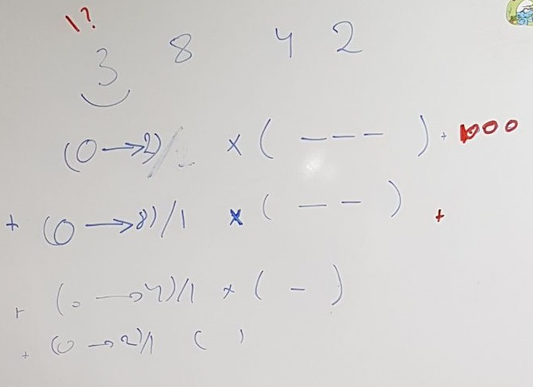
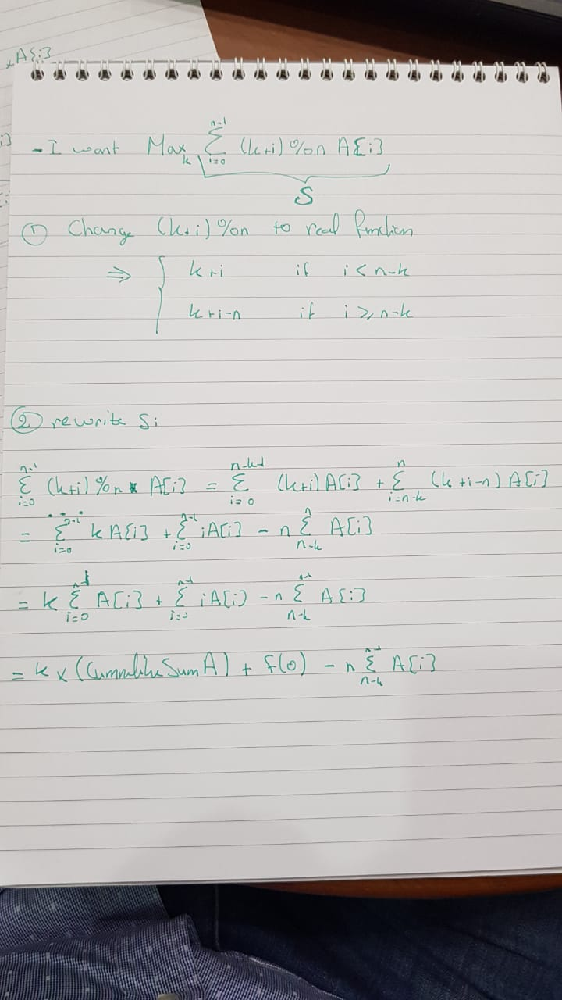

- [Amortization](#amortization)
  - [Remove unwanted Previous O(1) (using Linked List)](#remove-unwanted-previous-o1-using-linked-list)
    - [Next Greater / Max O(1)](#next-greater--max-o1)
    - [Remove Smaller/Bigger elements O(1)](#remove-smallerbigger-elements-o1)
- [Array](#array)
  - [Swipe left + Swipe right](#swipe-left--swipe-right)
  - [Inplace manipulation](#inplace-manipulation)
    - [Find missing values in array size n and values 1< a[i] < n](#find-missing-values-in-array-size-n-and-values-1-ai--n)
    - [Min/Max of moves to make array values reach a cndt (ex: all values are equal)](#minmax-of-moves-to-make-array-values-reach-a-cndt-ex-all-values-are-equal)
  - [Sorting](#sorting)
      - [K sum Problems](#k-sum-problems)
  - [Traversing](#traversing)
  - [Random Questions](#random-questions)
- [Bit Manipulation](#bit-manipulation)
  - [use bits as states](#use-bits-as-states)
  - [Bit Range Masking](#bit-range-masking)
- [Boyer-Moore Algo](#boyer-moore-algo)
- [Cumulative Sum](#cumulative-sum)
  - [Immutable](#immutable)
- [Cycle](#cycle)
  - [Floyd's Tortoise and Hare](#floyds-tortoise-and-hare)
- [Design](#design)
  - [Random Flip Matrix](#random-flip-matrix)
  - [TinyURL](#tinyurl)
  - [Tic-Tac-Toe](#tic-tac-toe)
  - [Cache](#cache)
  - [Iterator](#iterator)
  - [Amortization O(1)](#amortization-o1)
- [DP](#dp)
  - [**_1. Back-Tracking_**](#1-back-tracking)
    - [Output All Combinations/Permutations](#output-all-combinationspermutations)
      - [Which Value At index I (for I: start -> end)](#which-value-at-index-i-for-i-start---end)
      - [Multiple choices for index I (ex: take or leave)](#multiple-choices-for-index-i-ex-take-or-leave)
    - [Count/Answer using DFS (need to know all combinations)](#countanswer-using-dfs-need-to-know-all-combinations)
      - [Which Value At index I (for I: start -> end) 2](#which-value-at-index-i-for-i-start---end-2)
      - [Multiple choices for index I (ex: take or leave) 2](#multiple-choices-for-index-i-ex-take-or-leave-2)
    - [DFS/BFS in Matrix](#dfsbfs-in-matrix)
  - [**_2. Normal DP_**](#2-normal-dp)
    - [DFS + MEMO](#dfs--memo)
      - [Matrix](#matrix)
    - [KnapSack Style](#knapsack-style)
    - [Suffix x[i:n] / Prefix x[0:i] / Topo Sort](#suffix-xin--prefix-x0i--topo-sort)
      - [MAX / MIN](#max--min)
        - [Several Options/States (ex: rob or dont rob)](#several-optionsstates-ex-rob-or-dont-rob)
      - [COUNT](#count)
      - [TRUE / FALSE (think of Rec + Memo)](#true--false-think-of-rec--memo)
      - [Find all possible answers](#find-all-possible-answers)
    - [SubString x[i:j]](#substring-xij)
- [Greedy](#greedy)
- [Graphs](#graphs)
  - [BFS / DFS](#bfs--dfs)
    - [Level Traversal](#level-traversal)
  - [TOPO Sort / Dependency](#topo-sort--dependency)
  - [Dijkstra](#dijkstra)
  - [From START -> END state (state ex: word, char, number, fraction...)](#from-start---end-state-state-ex-word-char-number-fraction)
- [Hash Table](#hash-table)
- [Heap](#heap)
  - [Kth smallest/Largest...](#kth-smallestlargest)
- [Intervals](#intervals)
  - [Greedy](#greedy-1)
  - [Segmant/Interval Trees](#segmantinterval-trees)
- [Linked List](#linked-list)
  - [Reverse](#reverse)
- [Math](#math)
  - [Division](#division)
  - [Prime](#prime)
  - [Calculator](#calculator)
  - [Pow / SQRT](#pow--sqrt)
  - [Area](#area)
  - [Counting](#counting)
    - [Permutation](#permutation)
      - [Find kth value](#find-kth-value)
  - [Series / Sequence](#series--sequence)
- [Pointers](#pointers)
  - [Left / Right Pointers](#left--right-pointers)
    - [Swaping Values](#swaping-values)
    - [Sliding window](#sliding-window)
      - [Longest/Shortest Sequence/String](#longestshortest-sequencestring)
      - [Rabin-Karp](#rabin-karp)
  - [Start / End Pointers](#start--end-pointers)
    - [Calculate Value btw them](#calculate-value-btw-them)
  - [Pointer for each String/Array](#pointer-for-each-stringarray)
- [Regex](#regex)
- [Search](#search)
  - [Median](#median)
  - [Mapping](#mapping)
  - [D&G](#dg)
    - [Quick Select](#quick-select)
    - [Binary Search](#binary-search)
      - [Rotated Sorted Arraay](#rotated-sorted-arraay)
  - [Other](#other)
- [Serialization / Deserialization / Decoding](#serialization--deserialization--decoding)
- [Sorting](#sorting-1)
  - [Merge Sort](#merge-sort)
    - [K sorted lists](#k-sorted-lists)
  - [Paitence Sort](#paitence-sort)
  - [Radix Sort](#radix-sort)
  - [Tag Sort](#tag-sort)
  - [Top X](#top-x)
- [String](#string)
  - [Shifting](#shifting)
  - [Random](#random)
- [SQL](#sql)
- [Trie](#trie)
  - [Design](#design-1)
  - [Prefix/Word Search](#prefixword-search)
    - [Match Prefix/Word with DIFF](#match-prefixword-with-diff)
    - [Match Concatination of Words](#match-concatination-of-words)
  - [List Lexo order](#list-lexo-order)
  - [Next/Kth Enumeration/Value](#nextkth-enumerationvalue)
    - [From Dictionary of words](#from-dictionary-of-words)
    - [From given letters/digits](#from-given-lettersdigits)
      - [Optimized by sorting](#optimized-by-sorting)
- [Tree](#tree)
  - [Functionality](#functionality)
  - [Red/Black](#redblack)
  - [Augmented BST](#augmented-bst)
  - [Traversal](#traversal)
    - [Level By Level](#level-by-level)
    - [Recursive](#recursive)
    - [Iterative](#iterative)
  - [Finding (in) Path](#finding-in-path)
  - [Serialize / Deserialize BST](#serialize--deserialize-bst)
  - [Equality in BST](#equality-in-bst)
  - [Segment Tree / Fenwick](#segment-tree--fenwick)
    - [Search for All intervals that contain a query point](#search-for-all-intervals-that-contain-a-query-point)
    - [Sum of Given Range](#sum-of-given-range)
    - [Range Minimum Query](#range-minimum-query)
- [Union-Find](#union-find)
  - [Disjoint Sets](#disjoint-sets)
    - [Number of diff Sets](#number-of-diff-sets)

---

---

---

# Amortization

- When you want to do an operation in O(1) but u know it's hard to get it => think amortization
- check oneNote

## Remove unwanted Previous O(1) (using Linked List)

**_Hints_**

- this can be done using a **stack/LinkedList**

**_Problems_**

### Next Greater / Max O(1)

- [Min Stack](https://leetcode.com/problems/min-stack/description/)

  - desinged it using one stack and an array to keep track of the min value
  - this question is similar to the HW problem of **Min Queue** but the hw was harder since it depends on **_Amortization_**

- [Next Greater Element II](https://leetcode.com/problems/next-greater-element-ii/description/)
  - here they are asking about the Next Greater which means the __first elemnt to the right that is greater than the value at index i__
  - uses the same concept of **Max Queue**
  - but here we have to do 2 passes the same way and leaving the same stack since we are dealing with a circular array

- [Next Greater Node In Linked List](https://leetcode.com/problems/next-greater-node-in-linked-list/)
   - here they are asking about the Next Greater which means the __first elemnt to the right that is greater than the value at index i__
  - uses the same concept of **Max Queue** starting from the right => reverse the LinkedList
  - 

### Remove Smaller/Bigger elements O(1)

- [Remove K Digits](https://leetcode.com/problems/remove-k-digits/description/)

  - its a greedy algorithim
  - start from left to right
    - every char we encounter check in the stack (tail of linked list) if we have chars > current char
      - if yes remove them as long as k > 0

- [Remove Duplicate Letters](https://leetcode.com/problems/remove-duplicate-letters/description/)

  - VVVVVVVVVVIIIIIIIPPPPPPPPPPP
  - **Needs REVIEW**
  - **Practice this problem more**
  - This problem use a small idea from the **_Min Stack_ DS problem** which is:

    - when u insert you check:

      1. if the inserted char is smaller than the head of the stack
      2. if the char in the head of stack exists in the string after the inserted char (to garanty that the head will be present in the result)

      - if yes => pop head from stack
      - if no => push the current char

    - above cnd is in a while()

  - Time: O(n), Space: O(n)
  - Explanation:
    First, given "bcabc", the solution should be "abc". If we think about this problem intuitively, you would sort of go from the beginning of the string and start removing one if there is still the same character left and a smaller character is after it. Given "bcabc", when you see a 'b', keep it and continue with the search, then keep the following 'c', then we see an 'a'. Now we get a chance to get a smaller lexi order, you can check if after 'a', there is still 'b' and 'c' or not. We indeed have them and "abc" will be our result.

        Come to the implementation, we need some data structure to store the previous characters 'b' and 'c', and we need to compare the current character with previous saved ones, and if there are multiple same characters, we prefer left ones. This calls for a stack.

        After we decided to use stack, the implementation becomes clearer. From the intuition, we know that we need to know if there are still remaining characters left or not. So we need to iterate the array and save how many each characters are there. A visited array is also required since we want unique character in the solution. The line while(!stack.isEmpty() && stack.peek() > c && count[stack.peek()-'a'] > 0) checks that the queued character should be removed or not, like the 'b' and 'c' in the previous example. After removing the previous characters,push in the new char and mark the visited array.


- [132 Pattern](https://leetcode.com/problems/132-pattern/)
  - Question: __ai, aj, ak such that i < j < k and ai < ak < aj__
  - Can do it using merge/quick sort time:O(nlogn)
  - prefer to do it in time: O(n)
  - Explain:
    - at first start swiping left to get the min value of {0... i - 1} for index i
    - then start swiping right to have somthing like a __MaxStack__
      - how to fill this stack?
        - remove from stack if last objects are less than leftMinValue at this index in order to keep this part of condition i < j < k and ai < ak
        - add to this stack if current value is less than last object in stack
  - [solution](https://leetcode.com/problems/132-pattern/solution/)


---

---

---

---

# Array

## Swipe left + Swipe right

- [Product of Array Except Self](https://leetcode.com/problems/product-of-array-except-self/discuss/)
  * iterate from left to right to calculate the cumulative product
  * then iterate from right to left to calculate the cumulative product
  * time O(n), Space O(1)
  * [solution](https://discuss.leetcode.com/topic/18864/simple-java-solution-in-o-n-without-extra-space)

- [Minimum Moves to Equal Array Elements II](https://leetcode.com/problems/minimum-moves-to-equal-array-elements-ii/)
  - At first sort in Asc order
  - start by swipping from right to left
    - the count of iterations to make all values nums[i + 1....n] = nums[i] is: 
      - increments[index] = increments[index + 1] + (nums[index + 1] - nums[index]) * (nums.length -1 - index);
      - this mean countOfIncrementInCurrentIndex = countOfIncrementInIndex+1 + (diff of values btw nums[index + 1] and nums[index]) * numberOfValuesOnRightSide
  - now start swipping from left to right and do the same as previous step
    - previousCount = previousCount + (nums[index] - nums[index - 1]) * index;
  - for every index add the count of increment computed for this index from left side and from right side
  - TIme: O(n logn , Space: O(n)) (I think we can optimize)

- [132 Pattern](https://leetcode.com/problems/132-pattern/)
  - Question: __ai, aj, ak such that i < j < k and ai < ak < aj__
  - Can do it using merge/quick sort time:O(nlogn)
  - prefer to do it in time: O(n)
  - Explain:
    - at first start swiping left to get the min value of {0... i - 1} for index i
    - then start swiping right to have somthing like a __MaxStack__
      - how to fill this stack?
        - remove from stack if last objects are less than leftMinValue at this index in order to keep this part of condition i < j < k and ai < ak
        - add to this stack if current value is less than last object in stack
  - [solution](https://leetcode.com/problems/132-pattern/solution/)

- [Next Greater Element II](https://leetcode.com/problems/next-greater-element-ii/description/)
  - uses the same concept of **Min Queue**
  - but here we have to do 2 passes the same way and leaving the same stack since we are dealing with a circular array
  
---

## Inplace manipulation

### Find missing values in array size n and values 1< a[i] < n 

- [Find All Numbers Disappeared in an Array](https://leetcode.com/problems/find-all-numbers-disappeared-in-an-array/)
  - if value x found in array => then negate arr[x] 
  
- [Find All Duplicates in an Array](https://leetcode.com/problems/find-all-duplicates-in-an-array/)
   - similar


---

### Min/Max of moves to make array values reach a cndt (ex: all values are equal)

- [Minimum Moves to Equal Array Elements](https://leetcode.com/problems/minimum-moves-to-equal-array-elements/)
  - We can do it in diff ways:
    1. normal manipulation: O(n*count)
    2. Math
       - Time: O(n)
       - [explanation](https://leetcode.com/problems/minimum-moves-to-equal-array-elements/discuss/299009/Java-easy-with-detailed-explanation...)

- [Minimum Increment to Make Array Unique](https://leetcode.com/problems/minimum-increment-to-make-array-unique/discuss?currentPage=1&orderBy=hot&query=)
  - question asked by C


---

## Sorting

- [H Index](https://leetcode.com/problems/h-index)
  * can solve it in two ways:
    1. sort (O(n + d) bucket sort) then iterate in a Descending manner to reach an index where the (array.length - index) < arrays[index] (O(n))
    2. no need to sort, create an count[n] array [check solution](https://leetcode.com/problems/h-index/discuss/70810/A-Clean-O(N)-Solution-in-Java)


- [Queue Reconstruction by Height](https://leetcode.com/problems/queue-reconstruction-by-height/description/)
  - At first sort the array bases on __(o1, o2) -> o1[0] == o2[0] ? o1[1] - o2[1] : o2[0] - o1[0]__
  - Iterate over the sorted array and add the current person to a list in position = person[1] = number of people >=current height
  - time: O(n^2) 

- [Wiggle Sort](http://buttercola.blogspot.com/2015/09/leetcode-wiggle-sort.html)
  *  reorder it in-place such that nums[0] <= nums[1] >= nums[2] <= nums[3]...
  * only compare with the previous input
  * if Index is even and nums[nums[i] > nums[i - 1]] => swap i with i -1
    else if index is off and nums[i] <> nums[i - 1] => swap i with i-1


- [Wiggle Sort II](https://leetcode.com/problems/wiggle-sort-ii/description/)   
  * VVVVVVVVVVVVVVIIIIIIIIIIIIIIIPPPPPPPPPPPPPPPPPPPPPPP
  *  __Needs REVIEW__
  * __Practice this problem more__
  * here its more difficult since we can have == number beside each other
  * [perfect explanation](https://leetcode.com/problems/wiggle-sort-ii/discuss/77684/Summary-of-the-various-solutions-to-Wiggle-Sort-for-your-reference)
  

- [Sort Characters By Frequency](https://leetcode.com/problems/sort-characters-by-frequency/)
  - count the frequencry for every char in a Map
  - sort this map in deccending order
  - then output the chars into a string

- [Minimum Time Difference](https://leetcode.com/problems/minimum-time-difference/)
  - Algo :
    - Sort the values
    - then get the time diff btw i and i - 1
    - and at the end get diff btw n-1 and 0
  - My solution was using a TreeSet
  - [solution using sort](https://leetcode.com/problems/minimum-time-difference/discuss/354063/Easy-understanding-java-solution-using-sort)

---

#### K sum Problems
- [2 SUM](https://leetcode.com/problems/two-sum/description/)
  * Do it in O(n) + HashTable or sort without using hash table O(n logn)
  * [3 sum](https://leetcode.com/problems/3sum/discuss/) is (2 Sum) wrapped by a for loop => O(n * n)
    * since its O(n^2) => sort array better than using hashtable
  * [4 sum](https://leetcode.com/problems/4sum) is (3 sum)  wrapped by a for loop => O(n * n^2)
    * since its O(n^3) => sort array better than using hashtable
  * [Two Sum II - Input array is sorted](https://leetcode.com/problems/two-sum-ii-input-array-is-sorted/description/)
    * here its enough to do O(n) __no need for hash table__

- [K-diff Pairs in an Array](https://leetcode.com/problems/k-diff-pairs-in-an-array/)
  - similar to 2sum in the concept where upon iteration we check if the diff is already in the hashTable and then we add the current value to the hashTable 

- [3Sum Smaller](https://kennyzhuang.gitbooks.io/leetcode-lock/content/259_3sum_smaller.html)
  * the idea here is that we dont really care about the cnd 0 <= i < j < k < n as long we are counting the combination only once => any combination should be counted only once
  * Algo:
    1. sort the array
    2. loop over the array to get i     3. then use a while loop with two pointers j and k where j starts from i+1 and k starts from array.length - 1
    3. if we reach arr[i] + arr[j] + arr[k] < target => save total += k-j, ++j. Else --k
      we have ++j or --k since the array is sorted
  * time: O(n^2)


- [3Sum Closest](https://leetcode.com/problems/3sum-closest/)
  * the idea here is that we dont really care about the cnd 0 <= i < j < k < n as long we are counting the combination only once => any combination should be counted only once
  * Algo:
    1. sort the array
    2. loop over the array to get i     3. then use a while loop with two pointers j and k where j starts from i+1 and k starts from array.length - 1
    3. if we reach arr[i] + arr[j] + arr[k] is closest to target
  * time: O(n^2)

- [4Sum II](https://leetcode.com/problems/4sum-ii/)
  - Time: O(n^2)
  - Space: O(n ^2)
  - Here instead of sorting and array and using O(n^3) algo we dicided to:
    - store all possible combinations btw C and D in a map X
    - loop over A and B to check if we find  combinations in X

---

## Traversing

- [Diagonal Traverse](https://leetcode.com/problems/diagonal-traverse/)
  - Traverse the Matrix in a diagonal matter
  - transform the logical explanation into the code
  - check solution

- [Continuous Subarray Sum](https://leetcode.com/problems/continuous-subarray-sum/)
  - just did it in the dump way O(n^2)

---

## Random Questions

- [Sentence Screen Fitting](http://shirleyisnotageek.blogspot.com/2016/10/sentence-screen-fitting.html)
  - some [solutions](http://massivealgorithms.blogspot.com/2016/10/leetcode-418-sentence-screen-fitting.html)
  - 2 ways:
    1. A naive approach is to go through the screen and put each word in it. Whenever we find a word doesn't fit to the left cells, we switch to the next line.
    2. approach:
      - We first concatenate all strings together and add spaces between words. (This string is the actual length we need to fit the string)
      - Now we have a pos variable that initializes to 0, this is the position in the All string. 
      - Now for each row, we add cols to pos, this is the position in the All string that we can fit in the row. 
      - If the pos in the All string is pointing to a white space, we know we have just fitted (at least partial) strings in it. pos increment by 1. 
      - If its a letter, we know its in the middle of the word, so we need to decrease the pos to the start of the word.
      
        ```` java
          public int wordsTyping(String[] sentence, int rows, int cols) {
              String all = "";
              for (String s : sentence) {
                  all += s + " ";
              }
              int pos = 0;
              int len = all.length();
              for (int i = 0; i < rows; i++) {
                  pos += cols;
                  if (all.charAt(pos % len) == ' ') {
                      pos++;
                  } else {
                      while (pos > 0 && all.charAt((pos - 1) % len) != ' ') {
                          pos--;
                      }
                  }
              }
              return pos / len;
          }
        ```` 


- [Battleships in a Board](https://leetcode.com/problems/battleships-in-a-board/description/)
  - simple iteration over the 2D array and we need to just check if we reached an X
    - if this X has a previous X:
      - => if arry[row][col] = X and (arry[row - 1][col] || arry[row][col - 1]  ) = X 
      - => dont add number of ships

---

---

---

---


# Bit Manipulation

**_Hints_**

- oneNote

**_Problems_**

- [UTF-8 Validation](https://leetcode.com/problems/utf-8-validation/description/)
  - just check how many number of bytes we have from the first byte using {{0,0}, {2, 6}, {3, 14}, {4,30}}
  - the problem is simple:
    - from first byte we know how many bytes it follows
    - check the following byte if they start with 10xxxx
    - repeat until we reach end of data array

---

## use bits as states

- [Game of Life](https://leetcode.com/problems/game-of-life/description/)

  - in order to solve it in-place we need to depend on the bits of every int in the array:
    [2nd bit, 1st bit] = [next state, current state]

    - 00 dead (next) <- dead (current)
    - 01 dead (next) <- live (current)
    - 10 live (next) <- dead (current)
    - 11 live (next) <- live (current)

  - check [this solution](https://leetcode.com/problems/game-of-life/discuss/73223/Easiest-JAVA-solution-with-explanation)
  - for the infinite board part we need only to take as input the list of Live Coordinates no need for the full board => [infinite board solution](https://leetcode.com/problems/game-of-life/discuss/73217/Infinite-board-solution)


---

## Bit Range Masking

- [Number Complement](https://leetcode.com/problems/number-complement/submissions/)
  - in order to flip the bits we can XOR the range of bits we want to flip with a Range of all 1s => num ^ mask
  - Generating the mask to know which bits we can flip:
    - ex: 5 = 101 => we need to flip these 3 bits and not all 32 bits in int
    1. get position of highest 1 bit using Integer.highestOneBit(num)
    2. then generate the mask = int mask = (highestOneBit << 1) - 1;
    3. in order to flip the bits we can XOR the range of bits we want to flip with a Range of all 1s => num ^ mask

---

---

---

# Boyer-Moore Algo

- [Majority Element](https://leetcode.com/problems/majority-element/description/)
  - Read about [Boyer-Moore Algo](#Boyer_Moore)
  - runs in O(n) time and O(1) space
  - majority element must be > n/2
  - VVVVVVVVVVVVIIIIIIIIIIIIIIIIPPPPPPPPPPPPPPPPPPPPPPPPPPPPPPP

* [Majority Element II](https://leetcode.com/problems/majority-element-ii/description/)
  - its the generic form of Boyer-Moore algo
  - in this case they asked for: all number that are greater > n/3 => we have at most 2 numbers
  - Algo: we need two pointer one for each majority
  - VVVIIIPPP NOTE: while iterating if candidate1 passes by an index that has value of candidate2 we don't decrement the counter of candidate1 we only increments candidate2's counter
  - [solution](https://discuss.leetcode.com/topic/17564/boyer-moore-majority-vote-algorithm-and-my-elaboration)

---

---

---

# Cumulative Sum

## Immutable

**_Hints_**

- create an array to **store the cumulative sum at every index**

**_Problems_**

- [Range Sum Query 2D - Immutable](https://leetcode.com/problems/range-sum-query-2d-immutable/description/)

  - nice problem
  - create an intermidiate int[][] dp to save in it the sum of the square btw the current point and (0,0)
  - [solution](https://leetcode.com/problems/range-sum-query-2d-immutable/solution/)
  - i did the last solution

- [Maximum Size Subarray Sum Equals k](https://www.programcreek.com/2014/10/leetcode-maximum-size-subarray-sum-equals-k-java/)

  - VVVVVVVVVVVVVVIIIIIIIIIIIIIIIPPPPPPPPPPPPPPPPPPPPPPP
  - **Needs REVIEW**
  - **Practice this problem more**
  - could solve in using DP => O(KN)
  - but i did it by only one pass:
    - upon looping save the cummulative sum of every index in a Map, The key of map should be the sum and the value is the index
    - if we have encountered the same sum twice => save only the first index
    - upon every index try to find diff = currentCummulaticeSum - k if it exists. If yes fint the length of the subarray that sums to k
    - I used ideas from **Range Sum Query - Immutable**
  - time: O(n) space: O(n)

- [Max Sum of Rectangle No Larger Than K](https://leetcode.com/problems/max-sum-of-rectangle-no-larger-than-k/description/)

  - VVVVVVVVVVVVVVIIIIIIIIIIIIIIIPPPPPPPPPPPPPPPPPPPPPPP
  - **Needs REVIEW**
  - **Practice this problem more**
  - this problem is a combination of several problem
  - time: O(columns^2 _ rows _ log(rows))
  - space: O(rows)
  - approch:
    1. transform the 2D array to 1D. How?
    - get all combinations between the consecutive columns => time: O(columns^2)
      - ex: assum we have 3 columns for 1 (1->1, 1->2, 1->3), for 2: (2->2, 2->3), for 3: (3->3)
    1. for every 1D array use **Range Sum Query - Immutable** algo to solve the problem
    - but here we need currentCum - lowerCum <= k
    - => so we can use a TreeSet => lowerCum = treeset.ceiling(currentCum - k)
    1. use maxSum = Math.max(maxSum, currentCum - lowerCum)

- [Path Sum III](https://leetcode.com/problems/path-sum-iii/description/)
  <a id="Path_Sum_III"></a>
  - use a map to store the cummulative sum
  - and every time find if we have a countOfDiff = map.get(currentSum - sum)
  - if we find => add countOfDiff to the count

---

---

---

# Cycle

**_Hints_**

- Floyd's Tortoise and Hare
  - [link1](http://web.archive.org/web/20160323172731/http://learningarsenal.info/index.php/2015/08/24/detecting-start-of-a-loop-in-singly-linked-list/)
  - [link2](http://umairsaeed.com/blog/2011/06/23/finding-the-start-of-a-loop-in-a-circular-linked-list/)


``` java
    public static void isLoopPresent(ListNode nodeHead){

        ListNode slowPointer,fastPointer;
                 slowPointer = nodeHead;
                 fastPointer = nodeHead;

        boolean loopFound = false;

        while(fastPointer != null){

            fastPointer = fastPointer.next;

            if(fastPointer != null){
                fastPointer = fastPointer.next;
                slowPointer = slowPointer.next;
            }


            if(fastPointer == slowPointer){
               loopFound = true;
               // we need to break otherwise it will go on forever
               break; 
             }
        }

    if(loopFound){
        //move the slowPointer to the start of the list
        slowPointer = nodeHead;

        while(slowPointer != fastPointer){
            // prgressively moving both pointers one node at a time
            slowPointer = slowPointer.next;
            fastPointer = fastPointer.next;
        }

        System.out.println("Start of loop is "+ slowPointer.data);

    }else{
         System.out.println("No Loop Found");
      }

    }

```

**_Problems_**

## Floyd's Tortoise and Hare

- [Happy Number](https://leetcode.com/problems/happy-number/description/)
  - [explanation](https://leetcode.com/problems/happy-number/discuss/56919)
  - [my solution with Set](https://leetcode.com/problems/happy-number/discuss/56913)
  - [nice solution using Floyd cycle algo](https://leetcode.com/problems/happy-number/discuss/56917)
  - read more aboud Floyd Cycle in down in general info secion

- [Circular Array Loop](https://leetcode.com/problems/circular-array-loop/)
  - normal Floyd's Tortoise in an Array

---

---

---

# Design

## Random Flip Matrix

- [Random Flip Matrix](https://leetcode.com/problems/random-flip-matrix/)
  - dont generate all possible values in matrix, instead save the flipped ones
  - use random to generate a value to flip btw [0, rows*cols[

## TinyURL

- [TinyURL](https://leetcode.com/problems/encode-and-decode-tinyurl/)
  - check my solution its good
  - we can do more optimization on my solution
  - [solution](https://leetcode.com/problems/encode-and-decode-tinyurl/discuss/346421/Two-solutions-in-Java-base-62-and-random-generation)

## Tic-Tac-Toe

- [Tic-Tac-Toe](https://www.programcreek.com/2014/05/leetcode-tic-tac-toe-java/)

  - I did it in two ways:
    1. naive:O(n) everytime a player plays
    2. DP: O(1) time, O(n^2) space
  - they Did it in a better solution O(1)/play time and O(n) space
    - actually u dont need O(n^2)space u just need row[n] and col[n] and two ints for the diagonals
    - [check nice solution](https://www.programcreek.com/2014/05/leetcode-tic-tac-toe-java/)

## Cache

- [LRU Cache](https://leetcode.com/problems/lru-cache/discuss/)
  * can do it in a very simple way using LinkedHashTable (check the code I did)
  * to do it in a [proper way](https://discuss.leetcode.com/topic/6613/java-hashtable-double-linked-list-with-a-touch-of-pseudo-nodes):
    1. use normal Hash table to store the key as the key and as a value store a pointer     
    2. this pointer points to the representing object of the key in the doubly linked list which is used to sort the LRU objects

- [LFU Cache](https://leetcode.com/problems/lfu-cache/discuss/)
  * used a HashMap to store the key to its place in a List
  * used a List to store the Map<Key, Value> based on the key's frequency meaning that the first index in the list show all the key-value pair that have freq of 1 and second index means freq of 2 etc... (Like Bucket Sort)
  * my solution is similar to [this](https://discuss.leetcode.com/topic/69402/c-list-with-hashmap-with-explanation)
  * In order to achieve O(1) time we used 2 HashMaps and a List

- [TTLCache](https://www.java-success.com/implement-an-in-memory-cache-in-java/)
  - TTL cache is Time To Live cache which means upon reading the value its TTL will refresh

## Iterator


**_Hints_**

- Try to use actual **Iterator**

**_Problems_**

- [Flatten Nested List Iterator](https://leetcode.com/problems/flatten-nested-list-iterator/description/)

  - in this problem we have 3 proposed solution:
    1. solution1: use 2 stack (Stack<List<NestedInteger>>, Stack<Integer>) the first to save the stack and the second to save the index we are in for every list in the stack
    2. solution2: optimize solution1 to use only one stack => use Stack<Iterator<NestedInteger>> instead of Stack<List<NestedInteger>>
    - [solution](https://leetcode.com/problems/flatten-nested-list-iterator/discuss/80404/Simple-iterative-DFS-using-stack)
    1. solution3: use only Stack<List<NestedInteger>> but also flatten every list
    - [check solution](https://leetcode.com/problems/flatten-nested-list-iterator/discuss/80147/Simple-Java-solution-using-a-stack-with-explanation)
  - I did the first 2 solutions

- [Flatten 2D Vector](https://tonycao.gitbooks.io/leetcode-locked/content/LeetCode%20Locked/c1.10.html)
  - implement an iterator
  - check corner scenraio in my code
  - [solution](http://buttercola.blogspot.com/2015/08/leetcode-flatten-2d-vector.html)

- [Zigzag Iterator](http://buttercola.blogspot.com/2015/09/leetocode-zigzag-iterator.html)
  * it look like the __Flatten 2D Vector problem__
  * i did it with current vector and current index fields (check my code)
  * other [solution used List<Iterator>](https://discuss.leetcode.com/topic/26654/simple-java-solution-for-k-vector)

## Amortization O(1)

---

---

---

# DP

**_Hints_**

- **DP OR BackTracking:**

  - **output all possible options** => do **backTracking** algo
  - **get only one value** its better to try to find it using DP whether by **Iterative** or **recurssive + memo**
    - this one value may be **count all possible combinations**
  - **matrix and you want a to get an optimal value**:
    - try using **backTracking + memo => DP** algo
      => no need to spend time thinking about iterative way if it takes time to get the algo
      (ex: [Longest Increasing Path in a Matrix problem](https://leetcode.com/problems/longest-increasing-path-in-a-matrix/description/))

- DP:

  1.  Iterative
  2.  recursive + memo

- Ways to approach DP:

  1.  suffix: x[i:n]
  2.  prefix: x[0:i]
  3.  substring x[i:j]

- 5 Steps:
  1. Subproblems
     - $\#subproblems$
  2. Guess
     - $\#choices$
  3. recurrence
     - Time/Subproblem
  4. Order
     - $Total Time = \#subproblems \* Time/Subproblem$
  5. Origin problem

---

---

## **_1. [Back-Tracking](https://discuss.leetcode.com/topic/46161/a-general-approach-to-backtracking-questions-in-java-subsets-permutations-combination-sum-palindrome-partitioning)_**

- if asked to find the next permutation => use **Trie**
- **check oneNote on how to solve these kinds of questions**

### Output All Combinations/Permutations

**_Hints_**

- **if u want to return combinations**

  - save the values in a temp Collection
  - => use a temp arrayList or set or queue
  - but at the **base case copy all values** to the new array that ur ganna save (ex: **result.add(new ArrayList<>(container))**;)

- if u **dont want repetition or the same value in different place or u need to preserve order**

  - **use starting index** where every recursive call will start from this index and upwards
  - => **doesn't look at behind values**
  - ex: for(int **index = startingIndex**; index < nums.length; ++index)

- if we have **duplicates** => **sort the array** at first

  - and skip duplicate values if needed

- **check oneNote on how to solve these kinds of questions**

**_Problems_**

#### Which Value At index I (for I: start -> end)

- [Permutations](https://leetcode.com/problems/permutations/description/)

  - Can be done using Dynamic Programming
  - did it in two ways second is just a refactoring of the first where first
    - first I used: list<list<list<Integer>>> like in combination sum
    - second I used: list<list<Integer>> only
  - but I always have previous row answer and current row answer

- [PermutationsII](https://leetcode.com/problems/permutations-ii/description/)

  - similar to Permuations but added and if statement
  - SORT Array to have duplicates beside each other => easier to work with
  - this if statement checks if i dont have any value of the same number before the permutation index. Why would that work?
    Since if i have [1,2,3',3,4] (after sorting the array) the second 3 will generate for ex: XX3XX and X3XXX if now im generating the permutations of the first 3' one of the options will be X3'3XX for the XX3XX and the other will be X33'XX for the X3XXX and we have to prevent this duplication. So if we used the if we wont consider X33'XX for the X3XXX since we are inserting it in index 2 and we have a 3 in index 1.
  - [general solution - backtracking](https://discuss.leetcode.com/topic/46161/a-general-approach-to-backtracking-questions-in-java-subsets-permutations-combination-sum-palindrome-partitioning)

- [Increasing Subsequences](https://leetcode.com/problems/increasing-subsequences/)
  - same as Combination Sum II problem
  - we have duplicates but here we can order => we have to check if we passed a same value and did take it using a loop
    - this for loop:k = start -> i
      - why is it enough to check k from start and not before cz we already took start - 1?
        - cz the last value we took was at startIndex - 1 => we want to check if we skipped same value in range [startIndex, i[
          cz this is the only case if we did, we will have a duplicate
  
  ``` java
    boolean checkIfPassedSameValue(int[] nums, int startIndex,int i) {
      for (int k = startIndex; k < i; k++) {
         if (nums[k] == nums[i]) {
            return true;
         }
      }
      return false;
   }
  ```

- [Palindrome Permutation II](https://leetcode.com/articles/palindrome-permutation-ii/)

  - use the general permutation way (backtracking)

- [Factor Combinations](https://kennyzhuang.gitbooks.io/leetcode-lock/content/254_factor_combinations.html)
  - did it in DFS
    - pass the multiplier as a start point to decompose the multiplicent so that the decomposed factors are >= multiplier
      - => preserve the asc order in the resulting array
    - at every result u get even if its a subproblem add it to the result
      - (we cant wait until we reach the end)
  - I did it using DP
  - can do it like previous problems using DFS (using the general solution)

* [Expression Add Operators](https://leetcode.com/problems/expression-add-operators/description/)

  - did it using backtracking general solution
  - did a double backtracking to have a clearer solution
    1.  one for the numbers only
    2.  the other for the signs
  - used the algo of **BASIC CALCULATOR II**
  - check solution with [one-combined DFS](https://leetcode.com/problems/expression-add-operators/discuss/71895/Java-Standard-Backtrace-AC-Solutoin-short-and-clear)

* [Word Squares](http://massivealgorithms.blogspot.com/2016/10/leetcode-425-word-squares.html)

  - used backtracking to get all combinations
  - trie to find the prefix in the previous words
    <a id="Word_Squares"/>

* [Subsets](https://leetcode.com/problems/subsets/description/)

  - we dont need duplicate values => use starting Index
  - we need all lengths => at first create loop for length and then call dfs

* [Generate Parentheses](https://leetcode.com/problems/generate-parentheses/solution/)
  - **STUDY THIS PROBLEM**
  - **Needs REVIEW**
  - VVVVVVVVIIIIPPPPP problem
  - we do backtracking where at every subproblem we **have two choices at index i its either '(' or ')'**
  - => **try both** until we reach close == n and open == n

#### Multiple choices for index I (ex: take or leave)

- [Generalized Abbreviation](https://gist.github.com/cangoal/bb57a4879a3c892566028b74f1ce50ec)

  - did it in a backtracking way
  - [solution](https://gist.github.com/cangoal/bb57a4879a3c892566028b74f1ce50ec)
  - similar to solution 3 in the above link
  
---

### Count/Answer using DFS (need to know all combinations)

**_Hints_**

- **check oneNote on how to solve these kinds of questions**

**_Problems_**


- [Combination Sum](https://discuss.leetcode.com/topic/46161/a-general-approach-to-backtracking-questions-in-java-subsets-permutations-combination-sum-palindrome-partitioning)
  - backtracking with target
  - [geeksforgeeks](http://www.geeksforgeeks.org/unbounded-knapsack-repetition-items-allowed/)

- [Combination Sum II](https://leetcode.com/problems/combination-sum-ii/description/)
  - how to remove duplicate values (sort and then check if i > index && nums[i] == nums[i - 1])
  - here we need to output all combination that gives us a specific some
  - follow algo as in OneNote
  
- [Word Pattern II](https://www.programcreek.com/2014/07/leetcode-word-pattern-ii-java/)
  - time complexity O(n ^ n)
  - use **Word Pattern** problem
  - use a bit from [Justifying para DP problem](https://leetcode.com/submissions/detail/124226772/)

- [Remove Invalid Parentheses](https://leetcode.com/problems/remove-invalid-parentheses/)

  - do a normal DFS
  - time O(n)
  - at every index we recurs twice if current char is '(' or ')':
    1.  with this current char
    2.  without the current char
  - we can optimize it more but i didnt do it

- [Android Unlock Patterns](http://www.learn4master.com/interview-questions/leetcode/leetcode-android-unlock-patterns)

  - this problem asks only for the count of the different combinations and not to output the combinations and still we do backtracking

- [Minimum Unique Word Abbreviation](http://shirleyisnotageek.blogspot.com/2016/10/minimum-unique-word-abbreviation.html)

  - This is a combination of [Valid Word Abbreviation](http://shirleyisnotageek.blogspot.com/2016/10/valid-word-abbreviation.html) and [Generalized Abbreviation](https://gist.github.com/cangoal/bb57a4879a3c892566028b74f1ce50ec)
  - did it in a backtracking way
  - 2 steps to solve:
    1. generate Abbreviations of the word
       - generate them in a **smart way** so that u dont generate all of the abbs
       - **If we find the smallest valid Abb we return** => no need to check rest of Abb
    2. For every Abb generated we check if its valid within the Dict
       - if yes => Disregard it and find the next Abb

- [Additive Number](https://leetcode.com/problems/additive-number/description/)

  - Do back tracking
  - if int is so large => keep them as String and do addition on the fly


#### Which Value At index I (for I: start -> end) 2

- [Beautiful Arrangement](https://leetcode.com/problems/beautiful-arrangement/)
  - its like the permutation question where here we need all the different combinations that works
  - we can optimize this DFS a little by checking at every level the conditions that we have on the current Index
    - if it works => take the value and continue recursing
    - if not => skip this value
  - [solution](https://leetcode.com/problems/beautiful-arrangement/solution/) 

#### Multiple choices for index I (ex: take or leave) 2

- [Target Sum](https://leetcode.com/problems/target-sum/)
  - here we have to options per index wether its +X or -X
  
---

### DFS/BFS in Matrix

- [Shortest Distance from All Buildings](https://www.programcreek.com/2014/05/leetcode-shortest-distance-from-all-buildings-java/)

  - DFS in 2d Array
  - similar to "walls and gates"
  - typical DFS or BFS problem
  - I did it using a DFS, try to do it using BFS
  - pay attention to the trick (all building should reach the spot) i didnt implement that but its easy to do

- [Smallest Rectangle Enclosing Black Pixels](http://buttercola.blogspot.fr/2016/01/leetcode-smallest-rectangle-enclosing.html)

- [Walls and Gates](http://buttercola.blogspot.com/2015/09/leetcode-walls-and-gates.html)
  - I done 2 ways: DFS and BFS
  - the above solution starts from the gates and finds the empty space, while my solution starts from the empty space and find the gate

- [Pacific Atlantic Water Flow](https://leetcode.com/problems/pacific-atlantic-water-flow/description/)

  - 2 solutions:
    1. pass through every element in matrix and check if it reached pacific and atlantic
       - time: O($n^2 m^2$)
    2. pass through every shore of pacific and atlantic and check which elements they reach
       - time: O($n m^2 + n^2 m$)

- [Word Search](https://leetcode.com/problems/word-search/description/)

  - to search for the pattern you want, its only done in a recursive way

- [Word Search II](https://leetcode.com/problems/word-search-ii/description/)
  - VVVVVVVVVVVVVVVIIIIIIIIIIIIIIIIIIIPPPPPPPPPPPPPPPPPPPPPPPPPP
  - **_VEERYYYYY HARDDDD_**
  - **Practice this problem more**
  - this is done using:
    - **Trie** to store the words in the Dictionary
    - **DFS** to fetch a word in the TRIE by passing to the chars in the 2D array in a DFS pass
    - using a SET<String> to store the words that are found
      <a id="Word_Search_II"/>


- [Island Perimeter](https://leetcode.com/problems/island-perimeter/)
  - iterate over the matrix and when u reach the island do a DFS check the param
  - To check the param, at avery box with 1 check if it has island neibours on each side if a side doesnt have => add the count or params
  

---

---

## **_2. Normal DP_**


### DFS + MEMO

#### Matrix

- [Longest Increasing Path in a Matrix](https://leetcode.com/problems/longest-increasing-path-in-a-matrix/description/)

  - since its a 2D matrix => brute force solution is to do a backtracking algo
  - but since they only need a max value => we can optimize the algo by doing **backtracking + memo** => DP solution O(nm) time
  - [similar to my solution](<https://leetcode.com/problems/longest-increasing-path-in-a-matrix/discuss/78433/My-DP-solution-with-Explanation-Search-nearby-using-DFS.-O(MN)-Easy-to-read>)
  - In my solution I added a visited 2D array in order to make sure not to visit a cell that is already in the visiting process (check backtracking algos)
  - Some thoughts:
    - I was thinking of doing it in a iterative way rather a recursive way


---

### KnapSack Style

- [Combination Sum](https://discuss.leetcode.com/topic/46161/a-general-approach-to-backtracking-questions-in-java-subsets-permutations-combination-sum-palindrome-partitioning)

  - KnapSack problem can be optimized to use only 1D array instead of 2D array check how you solved it.
  - [geeksforgeeks](http://www.geeksforgeeks.org/unbounded-knapsack-repetition-items-allowed/)

- [Combination Sum2](https://leetcode.com/problems/combination-sum-ii/description/)

  - how to remove duplicate values (sort and then check if the array you are creating is in the list of dp)
  - read how others solved it

- [Partition Equal Subset Sum](https://leetcode.com/problems/partition-equal-subset-sum/description/)

  - KnapSack problem can be optimized to use only 1D array instead of 2D array check how you solved it.
  - here the size of the KnapSack = sum(array)/2
  - the weight of the stolen stuff is the values of the array

- [Perfect Squares](https://leetcode.com/problems/perfect-squares/description/#)

  - looks like Knapsack problem
  - time: O(n $\sqrt{n}$)
  - space: O(n)
  - this problem can be solved using a mathematical proof [Lagrange's Four Square theorem]
  - [all solutions](<https://leetcode.com/problems/perfect-squares/discuss/71488/Summary-of-4-different-solutions-(BFS-DP-static-DP-and-mathematics)>)

- [Best Time to Buy and Sell Stock II](https://leetcode.com/problems/best-time-to-buy-and-sell-stock-ii/solution/)
  - better to solve it in a greedy way
- [Best Time to Buy and Sell Stock III](https://leetcode.com/problems/best-time-to-buy-and-sell-stock-iii/description/)

  - **STUDY THIS PROBLEM**
  - **Needs REVIEW**
  - VVVVVVVVIIIIPPPPP problem
  - Solved it in two ways: (check both functions in code)
    1.  solved it in a full DP approach O($k\*I^2$)
    2.  but then i optimized it to O($K\*I$) VVVIIIIPPPPPPP method:
        1.  by saving the state of max profit upon buying a current stock on specific day.
        2.  This specific day should be < current day since the current day is the day to sell this bought stock
        3.  NOTE: buying a current stock at a specific day means that the previous stock should be sold if I bought a previous stock before
  - Equivalence with **Knapsack** => the Sac Size here is the number of transactions and the items here are the prices every day
  - did it in general for K transactions, it looks like Knapsack and stock hw problem
  - [explanation of my solution](https://discuss.leetcode.com/topic/4766/a-clean-dp-solution-which-generalizes-to-k-transactions)

- [Best Time to Buy and Sell Stock IV](https://leetcode.com/problems/best-time-to-buy-and-sell-stock-iv/)

  - this question has two parts
    1.  if k > prices.length/2 => solve it in a greedy way check [Best Time to Buy and Sell Stock II](https://leetcode.com/problems/best-time-to-buy-and-sell-stock-ii/solution/)
    2.  else solve it like [Best Time to Buy and Sell Stock III](https://discuss.leetcode.com/topic/4766/a-clean-dp-solution-which-generalizes-to-k-transactions)

- [Best Time to Buy and Sell Stock with Cooldown](https://leetcode.com/problems/best-time-to-buy-and-sell-stock-with-cooldown/description/)

  - in this question we dont have a limit on Transactions => no need for second dimension of length K like previous problems
    => only 1 is needed over the prices of every day
  - The problem here is the cool down => we need to keep the max profit after sell up till before yesterday so that we can calculate **maxProfitAfterBuy = max(profitAfterBuy, profitPreviousSell - price[i])**
    => we need to limit current maxProfitPreviousSell to max (i - 2) position
    => we always check max(maxProfitPreviousSell, profitAfterSellOfBeforeYesterday) => max(maxProfitPreviousSell, dp[i - 2])
  - we only need a dp[] to save the profitOfSell on everyday => space complexity O(n)
    - we can optimize the space complexity to O(1) by saving:
      1.  maxProfitPreviousSell (this is max profit after sell up till before yesterday)
      2.  profitMinus2 (profit Of Yesterday)
      3.  profitMinus1 (profit of Current)
  - check my code
  - most optimized algo:
    - time: O(N)
    - space: O(1)

- [Best Time to Buy and Sell Stock with Transaction Fee](https://leetcode.com/problems/best-time-to-buy-and-sell-stock-with-transaction-fee/description/)

  - same as previous solutions but this time with trasaction fee

- [Coin Change](https://leetcode.com/problems/coin-change/discuss/)
  - similar to **Subset Knapsack problem**

- [Coin Change 2](https://leetcode.com/problems/coin-change-2/)
  - similar to **Subset Knapsack problem**


---


---

### Suffix x[i:n] / Prefix x[0:i] / Topo Sort

#### MAX / MIN

- [Edit distance](https://leetcode.com/problems/edit-distance/)

  - DP problem which is similar to wildcard matching and Regular Expression Matching problems

- [Rectangular Blocks]()
  - check Recitation 5 DP course 2 

- [One Edit Distance](http://www.geeksforgeeks.org/check-if-two-given-strings-are-at-edit-distance-one/)

  - simpler version of Edit Distance which only takes O(n + m) time

- [Wildcard Matching](https://leetcode.com/problems/wildcard-matching/description/)

  - check [Regular Expression Matching](https://leetcode.com/problems/regular-expression-matching/description/) which was solved using recursion
  - solved this problem using topo sort
  - its a DP similar to Edit Distance with some modifications

- [N-Queens](https://leetcode.com/problems/n-queens/)

  - Can be done using DP

- [Maximum Subarray](https://leetcode.com/problems/maximum-subarray/description/)

  - <a id="Maximum_Sum_Subarray">Maximum Subarray</a>
  - **STUDY THIS PROBLEM**
  - **Needs REVIEW**
  - Find a way to do it in O(n) (DP)
  - It can be done using Divide and Conquer O(n lgn)

- [Contiguous Array](https://leetcode.com/problems/contiguous-array/)
  - we want to have a contigious array where 1s = 0s => 1s[i] - 1s[j] = 0s[i] - 0s[j] (j < i) => 1s[i] - 0s[i] = 1s[j] - 0s[j]
  - => the memo of a dp here is a Map where key is 1s[i] - 0s[i] at index i and value is index i
  - => at every index check if a diff saved in the map already => if yes take the length

- [Maximum Product Subarray](https://leetcode.com/problems/maximum-product-subarray/description/)

  - <a id="Maximum_Product_Subarray">Maximum Product Subarray</a>
  - **STUDY THIS PROBLEM**
  - **Needs REVIEW**
  - Find a way to do it in O(n) (DP)
  - for O(n) it differs from the of Max Sum Subarray by at every current value we calculate the Min and Max current value **ex: MaxCurrentValue = Math.max(nums[index], Math.max(maxProduct - nums[index], minProduct - nums[index]))** and the same for MinCurrentValue
  - It can be done using Divide and Conquer O(n lgn)
  - for D&C its a bit different from that of Max Sum Subarray by also keeping track of min on Left and min on Right to multiply them by each other and check if their product is the max

- [Palindrome Partitioning II](https://leetcode.com/problems/palindrome-partitioning-ii/description/)

  - VVVVVIIIIIIPPPPPPPP problemm
  - **STUDY THIS PROBLEM**
  - **Needs REVIEW**
  - can use the solution of [Longest Palindromic Substring](#Longest_Palindromic_Substring) with some modification
  - In a string every char may be considered as a palindrom by its own
    - => initial value of the dp[i] = i
  - the modification is whenever you have a palindrome (even if its not the largest one) check the necessary on cntds on it!!!!!
  - It was so hard to solve it despite the solution was easy

- [Maximal Square](https://leetcode.com/problems/maximal-square/description/)

  - VVVVVVVVVVVIIIIIIIIPPPPPPPPPPP questionnnnnnnnnn
  - **STUDY THIS PROBLEM**
  - **Needs REVIEW**
  - find the largest rectangle containing only 1's and return its area [solution](https://leetcode.com/articles/maximal-square/)
  - this is solved in a DP I didnt think about it in that way with O(n^2) time complexity
  - I solved it like [Maximal Rectangle](https://leetcode.com/problems/maximal-rectangle/description/) using the Histogram problem

- [Sherlock and Cost](https://www.hackerrank.com/challenges/sherlock-and-cost/problem)

  - looks a bit like the [House Robber problem](#House_Robber)
  - Algo gor guess:
    - lowValue = Math.max(prevLowValue, Math.abs(B[index + 1] - 1) + highValue);
    - highValue = Math.max(Math.abs(B[index] - 1) + prevLowValue, Math.abs(B[index] - B[index + 1]) + highValue);

- [Integer Replacement](https://leetcode.com/problems/integer-replacement/description/)

  - solve it using recursive + memorization
  - **note use long instead of int for corner cases**

  ```java
   if(num % 2 == 0)
        return dp[num] = 1 + solve(num/2);
    else
      return dp[num] = 1 + min(solve(num+1), solve(num-1));
  ```

- [Frog Jump](https://leetcode.com/problems/frog-jump/description/)

  - Iterative DP
  - **prefix problem x[0: i]**
  - Time: O(n^2) space O(n^2)
  - we iterate over every stone and then look at all previous stones to check if we can reach current stone from previous one (under cnd newK [oldK - 1, oldK + 1])

- [Bomb Enemy](http://massivealgorithms.blogspot.com/2016/06/leetcode-361-bomb-enemy.html)

  - easy to do it in brute force
  - but we can do it in time: O(mn) and space O(n) where m = rows and n = columns
  - check the solution in the link or check my solution
  - the brute force method is doing the same stuff many times so if we use a dp we can get the info needed of the current cell from the previous cell

- [Split Array Largest Sum](https://leetcode.com/problems/split-array-largest-sum/description/)

  - similar to **text justification** but taking into consideration the number of arrays as a constraint
  - 5 Steps:
    1. Subproblems:
       - we have to do the **text justification like algo** for every number of Arrays (numberOfArrays 1 -> m)
       - **text justification like algo**:
         - min sum for suffix array[i:]
       - $\#subproblems = O(m\*nums.length)$
    2. Guess:
       - where to end current array, say i:j
       - $\#choice = O(nums.length)$
    3. Recurrence:
       - dp[row][i] = min(max(sum(i, j), dp[row - 1][j - 1] for j in range({0 or row} -> i)))
       - $time/Subproblem = O(nums.length)$
    4. Order:
       1. row (++): 1 -> m
       2. i (--): nums.length - 1 -> row
       - $Total Time = \#subproblems * time/Subproblem = O(m*nums.length^2)$
    5. Solution: DP[m][nums.length - 1]

- [Integer Break](https://leetcode.com/problems/integer-break/description/)
  - 2 solutions:
    1. [math](https://leetcode.com/problems/integer-break/discuss/80751/A-Clear-Math-Proof-of-the-Algorithm):
       - dp[i] = dp[i-3] \* dp[3]
       - see explanation in link
       - time: O(n) but can be optimized
    2. [dp](https://leetcode.com/problems/integer-break/discuss/80694/Java-DP-solution)
       - time: O(n^2)

* [Ugly Number II](https://leetcode.com/problems/ugly-number-ii/description/)
  - At first we have to save for every prime factor its minimum index (call it Mi) which is the index that points to a value in values array and we will use it to get next Ugly Number = PrimFactor \* values[Mi]
  - loop for 1 -> n
    - check which prime factor will generate the current min ugly number
      - for every prime factor to generate current ugly number = prime factor \* values[Mi]
    - when current min ugly number is calculated **loop over all the prime factors and check if (current min ugly number) % prime factor == 0**
      - if it is => **increment Prime factor's Mi**
  - [solution](https://leetcode.com/submissions/detail/172546104/)
  - [explanation: check dp solution](https://www.geeksforgeeks.org/ugly-numbers/)

- [Super Ugly Number](https://leetcode.com/problems/super-ugly-number/description/)
  - the idea here we use counter for every prime in order to know which next value in the dp that we want to multiply it with

##### Several Options/States (ex: rob or dont rob)

- [Paint House](https://www.programcreek.com/2014/05/leetcode-paint-house-java/)

  - [optimal solution](https://discuss.leetcode.com/topic/32408/share-my-very-simple-java-solution-with-explanation)
  - this optimal solution is like mine

- [Paint House II](https://www.programcreek.com/2014/05/leetcode-paint-house-ii-java/)

  - solution with time: O(nk) and O(1) space (check my code) or [solution](https://discuss.leetcode.com/topic/22580/ac-java-solution-without-extra-space)
  - explanation:
    - The idea is similar to the problem Paint House I, for each house and each color, the minimum cost of painting the house with that color should be the minimum cost of painting previous houses, and make sure the previous house doesn't paint with the same color.
      - We can use min1 and min2 to track the indices of the 1st and 2nd smallest cost till previous house, if the current color's index is same as min1, then we have to go with min2, otherwise we can safely go with min1.
      - The code below modifies the value of costs[][] so we don't need extra space.
  
- <a id="House_Robber"/> [House Robber](https://leetcode.com/problems/house-robber/description/)

  - can be solved in a dp way with an array but we can optimize to use two fields (whether to rob current or not)
  - its based on whether to rob current house or not:
    - to rub current house = val[i] + dontRobPreviousHouse
    - not to rob current house = max(to rob previous, not to rob previous)

- [House Robber III](https://leetcode.com/problems/house-robber-iii/description/)

  - looks a bit like the [House Robber problem](#House_Robber)
  - think about it as HouseRobber for every house save wether to rob or not rob
  - but do it in a bottom-up manner => post order traversal:
    =>
    - so to decide if rob current => two children not robbed
    - to not rob current => Max(left.rob, left.notRob) + Max(right.rob, right.notRob)
  - [solution](https://leetcode.com/problems/house-robber-iii/discuss/79330/Step-by-step-tackling-of-the-problem)

- [Wiggle Subsequence](https://leetcode.com/problems/wiggle-subsequence/description/)
  - to solve this problem we need to count the number of alterantions between a Maxima and a Minima
  - time: O(n), Space: O(1)
  - [solution](https://leetcode.com/articles/wiggle-subsequence/)
  - similar to **finding the number of alternating max. and min. peaks in the array**

- [Sherlock and Cost](https://www.hackerrank.com/challenges/sherlock-and-cost/problem)

  - looks a bit like the [House Robber problem](
  - Algo gor guess:
    - lowValue = Math.max(prevLowValue, Math.abs(B[index + 1] - 1) + highValue);
    - highValue = Math.max(Math.abs(B[index] - 1) + prevLowValue, Math.abs(B[index] - B[index + 1]) + highValue);

- [Counting Boolean Parenthesizations]()
  - check Recitation 5 in DP course 2

#### COUNT

- [Decode Ways](https://leetcode.com/problems/decode-ways/description/)

  - determine the number of ways to decode? => we start with the initial value = 1 and just add
  - Pay Attention to corner cases cz "0" can't exist by itself since coding starts from 1 to 26 so if we reach "0" we should skip it (in a way cz we still have to process the two pointers)
  - Its an easy DP problem

- [Distinct Subsequences](https://leetcode.com/problems/distinct-subsequences/description/)

  - **STUDY THIS PROBLEM**
  - this question is similar to **Decode Ways** problems since both ask the number of ways to... and both are DP => the initial value of both is 1 for empty string
  - the relation for the other indices are just adding the previous values (ex: dp[i] = dp[i + 1] + dp[i + 2])

- [Paint Fence](https://www.programcreek.com/2014/05/leetcode-pain-fence-java/)

  - looks like the [House Robber problem](#House_Robber)
  - use traversal DP to solve this
  - O(n)
  - not necessary to use array[n] its sufficient to use only to variable (paintLikePrevious, dontPaintLikePrevious) => space: O(1)

- [Arithmetic Slices II - Subsequence](https://leetcode.com/problems/arithmetic-slices-ii-subsequence/)
  - here we have to count the number of combinations;
  - [explanation](https://leetcode.com/problems/arithmetic-slices-ii-subsequence/discuss/92822/Detailed-explanation-for-Java-O(n2)-solution)
  - My explanation:
    - so for every value in the array we check the diff with preceding values and if the preceding valeus have the same diff with other values
    - when we get a match => add the number of combination of the preciding values to the sum
      - why at current value we add the combinations of the preceding values?
        - since this combination value will actually be the number of combinations of the current value joind with the preceding values 

- [Jump II](https://leetcode.com/problems/jump-game-ii/discuss/)
  * resolve it or even solve [Jump](https://leetcode.com/problems/jump-game/description/)
  * we can use a greedy algorithm to solve it no need for DP 


#### TRUE / FALSE (think of Rec + Memo)

- Why True/False questions work with DP? - Since sometimes we can do backtracking (to get the answer)

  - And then add Memo => DP

- [Interleaving String](https://leetcode.com/problems/interleaving-string/description/)

  - [solution](https://leetcode.com/articles/interleaving-strings/)
  - VVVVIIPPPPP problem should solve it again(I solved like this one in the past but cant remember which question)
  - wrote it in two DP ways:
    1.  Topo way: O(n) space with two arrays, O(m\*n) complexity
    2.  recursive + memo: O(m* n) space, O(m*n) complexity
  - you dont need to consider a dimension in the memo for s3 since indexS3 = indexS1 + indexS2 (always try to reduce ur complexity)
    so if we have dp[indexS1][indexS2] its answer will always refer to (index1, index2, index3) where indexS3 = indexS1 + indexS2 and nothing else

- [Nim Game](https://leetcode.com/problems/nim-game/description/)
  - looks like **alternating coin game lecture 10 course 2**
  - somehow we have to find dp[n] = max(min(...), min(....))
  - [solution](https://leetcode.com/problems/nim-game/discuss/134338/Formal-way-of-dynamic-programming-(DP))

* [Frog Jump](https://leetcode.com/problems/frog-jump/description/)
  - Iterative DP
  - **prefix problem x[0: i]**
  - Time: O(n^2) space O(n^2)
  - we iterate over every stone and then look at all previous stones to check if we can reach current stone from previous one (under cnd newK [oldK - 1, oldK + 1])

#### Find all possible answers

- [Word Break II](https://leetcode.com/problems/word-break-ii/description/)

  - its a typical DP problem
  - It would be slow to to save all the String combinations while doing the DP instead for starting index save the possible ending indices
  - and then after finishing the DP do a DFS starting from index 0
  - solution like what i did [check solution 2](https://www.programcreek.com/2014/03/leetcode-word-break-ii-java/)

---

### SubString x[i:j]

- [Different Ways to Add Parentheses](https://leetcode.com/problems/different-ways-to-add-parentheses/description/)

  - VVVVVVVVVVVIIIIIIIIIIIIPPPPPPPPPPPPPPPPPP
  - **STUDY THIS PROBLEM**
  - **Needs REVIEW**
  - NOTE: looks like the Matrix Multiplication DP problem in course
  - can do it recursively and iter dp
  - time O(2^n) since we are outputting all the combinations and not the max
  - I thought i can do it like the the [general solution in the permutation] but it seems it cant be solved cz its hard to remove duplicate solutions
  - [solution](https://discuss.leetcode.com/topic/26076/java-recursive-9ms-and-dp-4ms-solution)

- [Scramble String](https://leetcode.com/problems/scramble-string/description/)

  - The difference btw scrambling and permutation is that in scrambling a subtree for the first word should have the same letters (diff order) as a subtree in the second word
  - looking at the example they gave, subtree "eat" and "tae" have the same letters but scrambled since subtree "at" and "ta" are scramble and "e" == "e" => these subtrees are scrambled with respect to each other
  - The important thing is that the sibling of the leaf nodes are the same in both trees (ex: "a" and "t" are sibling in "at" subtree and "t" and "a" are sibling in "ta") and ("e" and "at" are sibling in "eat" and "ta" and "e" are sibling in "tae" => "eat" and "tea" are scramble with respect to each other)
  - **_note: in order to know if two substrings are scramble They should have the same LENGTH_** => THATS WHY WE HAVE A LOOP OVER LENGTH
  - This problem looks like **Parenthesis DP Problem** (from inside to outside)
  - could be done in O(n^3) using DP and recursion.
  - check discussion to see the idea behind in for more info if you needed

- [Burst Balloons](https://leetcode.com/problems/burst-balloons/discuss/76228/Share-some-analysis-and-explanations)

  - VVVVVVVVVVVVVVVVVIIIIIIIIIIIPPPPPPPPPPPPPPPPPPPP
  - **Needs REVIEW**
  - **Practice this problem more**
  - this problem is **substring DP x[i:j]** just like the Parenthesis dp problem course 1 lec21
  - the **trick** in this problem is: Instead of divide the problem by the first balloon to burst, we divide the problem by the last balloon to burst.
  - [explanation](https://leetcode.com/problems/burst-balloons/discuss/76228/Share-some-analysis-and-explanations)

---

---

---

# Greedy

- [Patching Array](https://leetcode.com/problems/patching-array/description/)
  - VVVVVVVVVVVVVVVVVIIIIIIIIIIIPPPPPPPPPPPPPPPPPPPP
  - **Needs REVIEW**
  - **Practice this problem more**
  - Did it in 3 ways:
    1. using normal DP => O(KN)
    2. optimized it to become O(N) but still gave me time exceed since we are passing from 1 -> N one by one
    3. from solutions given by other people: [solution](https://leetcode.com/problems/patching-array/discuss/78488/Solution-+-explanation)
    - this solution is not intuative at all => its sooooo hardddd
    - read the explanation in the solution above carefully
  - [great explanation](https://leetcode.com/problems/patching-array/discuss/78500/Explanation-of-sum-range-coverage)

---

---

---

# Graphs

**_Hints_**

- Should know DFS, BFS, Topological Sort

## BFS / DFS

- [Valid Tree](https://www.programcreek.com/2014/05/graph-valid-tree-java/)
  - Given n nodes labeled from 0 to n - 1 and a list of undirected edges (each edge is a pair of nodes), check if these edges form a valid tree.
  - change list to adj Matrix (edges are undirected)
  - do a DFS with a boolean[] visited to detect if a node points to a visited node
    - if it does => we fail
    - if it doesn't => its a tree

- [Friend Circles](https://leetcode.com/problems/friend-circles/)
  - normal DFS algo using AdjMatrix
  - upon iterating on the nodes in the highest level:
    - if this nodes isnt yet visited => it will be a new root node in its seperate graph => new circle of friendship
  - This problem can also be solved in Union Find
    - It looks similar to NumberOfIslands problem
    - but here we are counting the number of friendships circles  

### Level Traversal

**_Hints_**

- its a modified BFS (check oneNote)
- add for loop to only traverse every time the current level nodes

- [Level By Level](#level-by-level)

---

## TOPO Sort / Dependency

- [Course Schedule](https://leetcode.com/problems/course-schedule/description/#)

  - its a dependency problem and we must find a cycle
  - so we can do it using topolical sort or DFS if at a certain point the adj vertex is grey => we have a cycle
  - pay attention when they say **to take course 0 you have to first take course 1, which is expressed as a pair: [0,1]** => the is directed

- [Course Schedule II](https://leetcode.com/problems/course-schedule-ii/description/)

  - we must output the courses in the needed order => TOPOLOGICAL SORT

- [alien language](https://www.geeksforgeeks.org/given-sorted-dictionary-find-precedence-characters/)

  - The idea is to create a graph of characters and then find topological sorting of the created graph.
  - Following are the detailed steps:

    1. Create a graph g with number of vertices equal to the size of alphabet in the given alien language. For example, if the alphabet size is 5, then there can be 5 characters in words. Initially there are no edges in graph.

    2. Do following for every pair of adjacent words in given sorted array.

       - Let the current pair of words be word1 and word2. One by one compare characters of both words and find the first mismatching characters.
       - Create an edge in g from mismatching character of word1 to that of word2.

    3. Print topological sorting of the above created graph.

---

## Dijkstra

- [Swim in Rising Water](https://leetcode.com/problems/swim-in-rising-water/description/)
  - I used a modified version of Dijkstra
  - the relaxing method is diff here
    - instead of d[u] = d[v] + w(u, v)
    - we use d[u] = Max(d[v], grid[u])

---

## From START -> END state (state ex: word, char, number, fraction...)

- [Minimum Genetic Mutation](https://leetcode.com/problems/minimum-genetic-mutation/)
  <a id="Minimum_Genetic_Mutation"></a>
  - We want to go from start word to end word => minimum DFS
  - Vertex: every String in bank
  - Edges: edges btw words are available if word1 and word2 diff only by 1 gene
    - I used **Trie** to check if we can create an edge btw two words
  - [solution](<https://leetcode.com/problems/minimum-genetic-mutation/discuss/160892/Java-DP(DFS-and-memo)-+-Trie>)

* [Word Ladder](https://leetcode.com/problems/word-ladder/description/)

  - similar Explanation as [Minimum Genetic Mutation](#Minimum_Genetic_Mutation)

* [Evaluate Division](https://leetcode.com/problems/evaluate-division/description/)

  - its similar to **alien language problem**
  - make every String in the equations a vertex => the numerators and denominators arte vertices
  - the edges btw the vertices are weighted => weight btw 2 vertices X and Y = to X/Y
  - => to calculate the division btw X/Y we should do a DFS or BFS from X to Y
  - **NOTE: I DONT CARE WHAT GRAPH ALGO I USE CZ THE DIVISION WILL ALWAYS BE THE SAME => SAME TO USE DFS OR DIJKASTRA**

* [Largest Divisible Subset](https://leetcode.com/problems/largest-divisible-subset/description/)

  - VVVVVVVVVVIIIIIIIPPPPPPPPPPP
  - **Needs REVIEW**
  - **Practice this problem more**
  - Solution 1:
    - I started to think about this solution as a graph
      - every number is a vertex
      - and every Si % Sj = 0 || Sj % Si = 0 is a directed edge between Vj and Vi depends which is bigger
        - to prevent doing Si % Sj = 0 || Sj % Si = 0 => sort the nums in asc order
    - To make life easier upon building the graph try to make it directly a MST (in this case Maximum Spanning Tree) which means for every:
      - we only have one parent
      - the node will be assigned to the parent that has the longest path (not shortest!!)
    - upon building the graph save also the longest path in order to return it at the end
    - basically this Algo is a DFS => Time: O(n^2), Space: O(n)
  - Solution 2:
    - I tried to optimize Solution 1
    - Start by sorting the nums as above solution
    - Then iterate through nums, upon every value find if its divisors are within the array (should be already treated)
      - to find the divisors => loop i: 1 -> i\*i <= currentValue
      - find the divisor with the longest Path that is available
        - make this divisor as parent of current Value (to get the result array at the end)
        - make the path length of currentValue = path length of longest divisor + 1
    - at the end since we have the longest value => backtrack to find the sequence
    - time: O(n sqrt(n)), Space: O(n)

* [Reconstruct Itinerary](https://leetcode.com/problems/reconstruct-itinerary/description/)

  - its a nice problem
  - do a typical DFS
  - since we need the final answer the list lexical order and to save some time from comparing every answer => **order every adj node for a node**
  - if we reach a solution where we have total number of tickets = to number of tickets we have now => return true and finish
    => dont search anymore
  - **NOTE**:
    1. Thus it’s natural to think about the “backtracking” feature of DFS.
    2. We start by building a and then sorting vertices in the adjacency list so that when we traverse the later, we can guarantee the lexical order of the itinerary can be as good as possible.
    3. When we have generated an itinerary, we check if we have used all our airline tickets. If not, we revert the change and try another ticket. We keep trying until we have used all our tickets.
  - [gd solution](https://leetcode.com/problems/reconstruct-itinerary/discuss/78799/Very-Straightforward-DFS-Solution-with-Detailed-Explanations)

---

---

---

# Hash Table
  
- [Bulls and Cows](https://leetcode.com/problems/bulls-and-cows/description/)
  * did it using one array[10] => space O(1) and two passes => time O(n)
  * another [solution with only one pass](https://leetcode.com/problems/bulls-and-cows/discuss/74621/One-pass-Java-solution)

- [K-diff Pairs in an Array](https://leetcode.com/problems/k-diff-pairs-in-an-array/)
  - similar to 2sum in the concept where upon iteration we check if the diff is already in the hashTable and then we add the current value to the hashTable 

- [Longest Consecutive Sequence](https://leetcode.com/problems/longest-consecutive-sequence/description/)
  * Description : Given an unsorted array of integers, find the length of the longest consecutive elements sequence
  * did this problem in a hard way but you could do it in a much simpler way [my solution](https://discuss.leetcode.com/topic/6148/my-really-simple-java-o-n-solution-accepted)
  * __Needs REVIEW__   
  * __Practice this problem more__
  * check this [solution](https://discuss.leetcode.com/topic/25493/simple-fast-java-solution-using-set)
  
---

---

---

# Heap

- [Rearrange String k Distance Apart](https://www.programcreek.com/2014/08/leetcode-rearrange-string-k-distance-apart-java/)
  - I solved it like the solution
  - use a MaxQueue to store the char based on their current Frequency.
  - every time you use remove a char from the queue:
    1- add it to the StringBuilder
    2- decrement its freq
    3- add it to a set (name it InWindow) of chars currently withen window K if its freq > 0
    else throw it away
    4- at the end try to remove the char of stringBuilder.charAt(length - k) from InWindow and add it again to the MaxQueue

---

## Kth smallest/Largest...

- [Merge k Sorted Lists](#merge_k_Sorted_Lists)

- [Kth Smallest Element in a Sorted Matrix](#kth_Smallest_Element_in_a_Sorted_Matrix)

- [Find K Pairs with Smallest Sums](https://leetcode.com/problems/find-k-pairs-with-smallest-sums/description/)
  - to solve this problem i used MinQueue
  - at any time the elements in the min queue are O(k) elements
  - time: O(k log k)
  - Algo:
    - at first we start by habing {0,0} indecies in the minQueue
    - when we pop a pair from the queue we should:
      - add minPair to result
      - add pair {minPair[0] + 1, minPair[1] + 1} to minQueue
      - check minPair[0] < nums1.length - 1 && minPair[1] == 0 ? => add {minPair[0] + 1, minPair[1]} to minQueue
        - **why?** cz we need to make sure that pair {minPair[0] + 1, minPair[1] + 1} is less than {minPair[0] + 1, minPair[1]}
    - keep doing this until we reach size = k

- [Top K Frequent Elements](https://leetcode.com/problems/top-k-frequent-elements/description/)
  - create a hashMap to save Frequency per value
  - sort the values according to frequency
  - get first K (we can use PriorityQueue)

---


- [Meeting Rooms II](https://www.programcreek.com/2014/05/leetcode-meeting-rooms-ii-java/)
  * it looks the same as the greedy algo in [course 2 lecture 1 (interval scheduling)](https://ocw.mit.edu/courses/electrical-engineering-and-computer-science/6-046j-design-and-analysis-of-algorithms-spring-2015/lecture-notes/MIT6_046JS15_writtenlec1.pdf)
  * can use Priority Queue to get earliest finish time
  * [check weighted interval scheduling](https://ocw.mit.edu/courses/electrical-engineering-and-computer-science/6-046j-design-and-analysis-of-algorithms-spring-2015/recitation-notes/MIT6_046JS15_Recitation1.pdf)
   if its weighted => DP is needed

---

---

---

# Intervals

## Greedy

**_Hints_**

- use Greedy when **optimization problem** with **unity weight**
- check _Greedy_ and _Greedy vs DP sections_ in OneNote

**_Problems_**

- [Non-overlapping Intervals](https://leetcode.com/problems/non-overlapping-intervals/description/)

  - same solution as the interval scheduling idea
  - sort by finish time
  - instead of removing the overlapping now we have to count them

- [Find Right Interval](#Find_Right_Interval)

  - sort by starting point

- [Interval Scheduling](#interval-scheduling)

  - similar to the problem in course2 lect 1
  - sort by finishing time
  - check Greedy section oneNote
  - Approach
    - use first finishing time rule to select interval i
    - reject all intervals that overlap selected i
    - repeat until we finish

- [Course Schedule III](https://leetcode.com/problems/course-schedule-iii/description/)
  - greedy approach
  - use PriorityQueue to remove largest Iterval
  - [solution](https://leetcode.com/problems/course-schedule-iii/solution/)

---

## Segmant/Interval Trees

- [Data Stream as Disjoint Intervals](#data_stream_as_disjoint_intervals)


---

---

---

# Linked List

**_Hints_**

- Try to use **DummyHead**
- Runner technique: use more than one pointers separated btw each other with a constant distance (cracking coding interview p93)
- If end -> beginning (reverse order) **ex: Plus One Linked List** => 2 ways:
  1. recursive
  2. reverse order + compute + reverse order again
- when re-arranging nodes make sure to change node.next to appropraite value or null
  - ex: **Odd Even Linked List**

**_Problems_**


- [Remove Nth Node From End of List](https://leetcode.com/problems/remove-nth-node-from-end-of-list/description/)
  * use two pointers with distance K

- [Flatten a Multilevel Doubly Linked List](https://leetcode.com/problems/flatten-a-multilevel-doubly-linked-list/description/)

  - used DFS to recurse on children pointers
  - returned head and tail when recursing
  - used DummyHead

- [Odd Even Linked List](https://leetcode.com/problems/odd-even-linked-list/description/)

  - use 2 DummyHeads:
    1. for odd head
    2. for even head

- [Reorder List](https://leetcode.com/problems/reorder-list/description/)
  - partition list to two parts and use Reverse Linked List in this problem for the second part

- [Partition List](https://leetcode.com/problems/partition-list/description/)
  * use a dummyHead and a dummyX where the values less than x put them children for dummyHead and values >= x but them as children for dummyX.
  * at end link the last child in dummyHead to the first child in dummyX

- [Copy List With Random Pointer](https://leetcode.com/problems/copy-list-with-random-pointer/description/)
   * __Practice this problem more__    
   * nice soltuion to do it in O(n) time and O(1) space
   * its all about how to manipulate the pointers to make this achieve complexity
   * VVVVIIIIPPPPPPPPP

## Reverse

- [Palindrome Linked List](https://leetcode.com/problems/palindrome-linked-list/description/)
  * at first reach node at length/2
  * reverse next part of the list
  * compare if the nodes are the same
  * time: O(n), space O(1)

---

---

---

# Math

**_Hints_**

- pay attention for overflows (ex: **Guess Number Higher or Lower**)
- try to find a pattern
  - a way so that current state can be represented in previous state, ex(Rotate Function problem): **F(k) - F(k - 1) = .....**
- if we have **'(' or ')'** think about calling **method recursively**

**_Problems_**

## Division

- [Divide Two Integers](https://leetcode.com/problems/divide-two-integers/description/)

  - did it in a logarithmic way
  - check oneNote for algo explanation
  - [solution](https://leetcode.com/problems/divide-two-integers/discuss/161358/Concise-JAVA-solution-without-using-long)

- [Fraction to Recurring Decimal](https://leetcode.com/problems/fraction-to-recurring-decimal/description/)
  - use **division by hand method**
    - check oneNote for how to do it
  - use a map to store the remainder and its place in the string
    - since if we have a fractional repeat => we have a repeatition in the rem => we can detect it where to add "("

---

## Prime

- [Count Primes](https://leetcode.com/problems/count-primes/description/)
  - check oneNote -> Math part
  - lets start with finding a Prim it takes O(radical n)
    - since it will be a FOR LOOP FROM 2 TO RADICAL(N)
  - now if we look at number of primes less than N => its takes O(n) time and space
    - Algo: [solution](https://www.mkyong.com/java/how-to-determine-a-prime-number-in-java/)
    - pass by every prim number starting from 2 up till n-1 and check its multiples

---

## Calculator

- [Evaluate Reverse Polish Notation](https://leetcode.com/problems/evaluate-reverse-polish-notation/discuss/)

  - use stack to solve it

- [Basic Calculator](https://leetcode.com/problems/basic-calculator/description/)

  - call the **calculate function recursively when u reach a '(' char**
  - check call its only O(n)
  - **use isAddition** (that is set according to meeting a '+' or '-') to record the operation thats ganna happen with the next number

- [Basic Calculator II](https://leetcode.com/problems/basic-calculator-ii/description/)
  - VVVVVVVVVVIIIIIIIPPPPPPPPPPP
  - **Needs REVIEW**
  - **Practice this problem more**
  - now since we have \* and / we have to walk and look for the operators and then depending on operator we treat the previous value and the current value
  - no need for stack => O(n) time O(1) space
  - check [solution](https://discuss.leetcode.com/topic/17435/java-straight-forward-iteration-solution-with-comments-no-stack-o-n-o-1)

---

## Pow / SQRT

- [pow](https://leetcode.com/problems/powx-n/)

  - can be done in O(log n)
  - we have **2 corner cases**:
    - we do the **if(n < 0)** after the recursive call and not before
      - since n may be equal to Integer.MIN_VALUE => if we transformed it into n = -n at the beginning we will have overflow
    - if n == 0 => return 1
  - check this [solution](https://leetcode.com/submissions/detail/171618647/)

- [Factorial Trailing Zeroes](https://leetcode.com/problems/factorial-trailing-zeroes/discuss/)

  - VVVVVVVVVVIIIIIIIPPPPPPPPPPP
  - **Needs REVIEW**
  - **Practice this problem more**
  - The only tricky thing about this problem is to determine how many 5s are there.
    - so divide by 5 and by powers of 5
  - VVIIIPPPP: very nice [explanation](https://discuss.leetcode.com/topic/6513/simple-c-c-solution-with-detailed-explaination)
  - check my solution is based on this [link](https://math.stackexchange.com/questions/142126/how-many-zeroes-are-in-100)

- [Valid Perfect Square](https://leetcode.com/problems/valid-perfect-square/description/)

  - similar to sqrt
  - check sqrt formulas in OneNote

- [Power of Three](https://leetcode.com/articles/power-of-three)

  - i did it using for loop => O(log3 n)
  - the O(1) solution is so silly: return n > 0 && 1162261467 % n == 0;
  - check their solution

- [Power of Four](<https://leetcode.com/problems/power-of-four/discuss/80456/O(1)-one-line-solution-without-loops>)
  - VVVVVVVVVVVVVVVVIIIIIIIIIIIIIIIIIIIIPPPPPPPPPPPPPPPPPPPPPPPPPPPPPP
  - **Needs REVIEW**
  - **Practice this problem more**
  - 2 ways:
    1.  return Integer.bitCount(num) == 1&& Integer.numberOfTrailingZeros(num) % 2 == 0;
    2.  return (num > 0) && ((num & (num - 1)) == 0) && ((num & 0x55555555) == num);
    - The basic idea is from power of 2, We can use “n&(n-1) == 0” to determine if n is power of 2.
    - For power of 4, the additional restriction is that in binary form, the only “1” should always located at the odd position.
    - For example, 4^0 = 1, 4^1 = 100, 4^2 = 10000.
    - So we can use “num & 0x55555555==num” to check if “1” is located at the odd position.
  - **second solution is better cz it doesn't depend on a specific language**

---

## Area

- [Rectangle Area](https://leetcode.com/problems/rectangle-area/discuss/62138)
  - Area = Arec1 + Arec2 - Aintersection
  - Aintersection = (Max(left) - Min(Right)) \* (Min(upper) - Max(bottom))
  - if (Min(upper) <= Max(bottom) || Max(left) >= Min(Right)) => **they dont intersect**
  - [solution](https://leetcode.com/submissions/detail/171631752/)

---

## Counting

- [Number of Digit One](https://leetcode.com/problems/number-of-digit-one/solution/)
  - can be done in O(logn) the base of log is 10
  - the values between the () is equal to all the possible number of ones up until the previous digit
    - example: for digit 3 the () is all the possible 1s < 1000
  - check the code to understand explanation
  - [official solution](https://leetcode.com/articles/number-of-digit-one/)
  - 

### Permutation

- [Count Numbers with Unique Digits](https://leetcode.com/problems/count-numbers-with-unique-digits/description/)
  - this problem is basically a permutation problem since they want to count the number with unique digits => permutation of 9Pn
  - we solve it using DP since f(n) = f(n-1)\* (10- (n-1))
    => check [solution](<https://leetcode.com/problems/count-numbers-with-unique-digits/discuss/83041/JAVA-DP-O(1)-solution.>)

#### Find kth value

- [Permutation Sequence](https://leetcode.com/problems/permutation-sequence/discuss/)
  - the above link shows how to solve it and that how I solved it
  - practice it more

---

## Series / Sequence

- [Missing Number](https://leetcode.com/problems/missing-number/description/)

  - Given an array containing n distinct numbers taken from 0, 1, 2, ..., n, find the one that is missing from the array.
  - use Gauss Formula **(arithmetic series) = n(n+1)/2**
  - can be also solved using bit manipulation (VVVVVIIIIPPPPPP)
  - [solution](https://leetcode.com/problems/missing-number/solution/)

- [Arithmetic Slices](https://leetcode.com/problems/arithmetic-slices/description/)

  - VVVVVVIIIIPPPPPPP
  - Idea uses **arithmetic series calculation**
  - There are 3 steps to do here
    1. we need to find the appropriate windows for the series determind
       - I used two pointers left and right
       - As long as A[right] - A[right - 1] = Current_Window_Diff we ++right => current window increase
    2. Determine number of **combinations per window**
       - this is the arithmetic series calculation part
       - $count/window = \sum*{j= 3}^{len} \sum*{k= 3}^{j} 1 = \dfrac{(len - 2)\*(len - 1) }{2}$
    3. Total count = sum(combinations per window)
  - time O(n)
  - space O(1)

- [Arranging Coins](https://leetcode.com/problems/arranging-coins/description/)

  - use arithmetic series
  - this time we have the total number n
    - => $\sum\_{j= 1}^{k} i = n \rightarrow \dfrac{k^2}{2} + \dfrac{k}{1} - n \leq 0 \rightarrow$ k = positive root of equation

- [RotateFunction](https://leetcode.com/problems/rotate-function/)
  - consider finding patterns (F(n) = F(n-1).... )
  - [other solution using F(k) - F(k - 1)](<https://leetcode.com/problems/rotate-function/discuss/87853/Java-O(n)-solution-with-explanation>)
  - 
  - time: O(n)

---

---

---

# Pointers

## Left / Right Pointers

### Swaping Values

- [Move Zeroes](https://leetcode.com/problems/move-zeroes)

  - Approach:
    - here we need to keep a left pointer for the first zero
    - the right pointer is just traversing the array
    - when ever right > left and left pointing to zero => swap
  - its a nice problem and there are several ways to solve it
  - [best solutions](https://leetcode.com/articles/move-zeroes)

- [Remove Duplicates from Sorted Array II](https://leetcode.com/problems/remove-duplicates-from-sorted-array-ii/description/)
  - Its nice how we can use two pointers (slow and fast) within only one loop (REMEMBER THIS GENERIC FORM)
  - it looks like _Minimum Window Substring_ problem somehow

- [String Compression](https://leetcode.com/problems/string-compression/)
  - every char will be followed by the number of accurances 
  - [solution](https://leetcode.com/problems/string-compression/solution/)

### Sliding window

**_Hints_**

- Think about **you will have start and end index**
- String matching Algo:

  - [Rabin-Karp algorithm](https://en.wikipedia.org/wiki/Rabin%E2%80%93Karp_algorithm)
    - [check how Hash Function is done](https://www.geeksforgeeks.org/searching-for-patterns-set-3-rabin-karp-algorithm/)
    - in the hash function we dont care about the length of the hash value cz its always mod p (p is prime)
    - check recitation of lecture 9 course 1
    - append(val) = (u*a + val) mod p = (u mod p) * a + val mod p
    - skip(val) = (u - val _ (a^(|u| - 1) mod p) mod p = ((u mod p) - val _ (a^(|u| - 1) mod p)) mod p
  - [Knuth-Morris-Pratt](https://www.youtube.com/watch?v=D6dCOa_gMoY)

#### Longest/Shortest Sequence/String

**_Hints_**

- Generic Pattern 1 vs Generic Pattern 2:
  - 1: end starts from 0; 
  - 2: end start from -1

- Generic Pattern 1: end starts from 0;
  
  ``` java

    static int lengthOfLongestSubstringTwoDistinct(String s, int k) {
      // do proper initialization as per the question
      Map<Character, Integer> freq = new HashMap<>();
      int maxSize = 0;

      // start from zero in both left and right pointers
      int start = 0;
      int end = 0;
      int length = s.length();

      // here make sure end < length
      while (start < length && end < length) {

          // here make sure end < length 
          // make sure u didnt reach the condition u want
         while (end < length && freq.size() <= k) {
            char c = s.charAt(end);

            // do question logic for what we need upon incrementing Right
            // this part should be substituted with specific question logic
            int currentFreq = freq.getOrDefault(c, 0);
            freq.put(c, currentFreq + 1);

            // check condition to get the answer
            // this part could be the same across multiple question
            // when asking about the maxSize we can get
            if (freq.size() <= k) {
               maxSize = Math.max(maxSize, end - start + 1);
            }
            end++;
         }

         while (start < end && freq.size() > k) {
            char c = s.charAt(start++);
            int currentFreq = freq.get(c);

            // do question logic for what we need upon incrementing left
            // this part should be substituted with specific question logic
            if (currentFreq == 1) {
               freq.remove(c);
            } else {
               freq.put(c, currentFreq - 1);
            }
         }
      }

      return maxSize;
    }
  ```


- Generic Pattern 2: end start from -1

``` java

   public int minSubArrayLen(int s, int[] nums) {
     // do proper initialization as per the question
      int bestLeft = 0;
      int bestRight = Integer.MAX_VALUE;
      int sum = 0;

      // start from zero in left 
      // start from -1 in right
      int left = 0;
      int right = -1;

      // here make sure end < length  - 1
      while(right < nums.length - 1) {

          // here make sure end < length  - 1
          // make sure u didnt reach the condition u want
         while (right < nums.length - 1 && sum < s) {
            sum += nums[++right];
         }

        // check condition to get the answer
        // this part could be the same across multiple question
        // when asking about the maxSize we can get
         if (sum >= s) {
            if (bestRight - bestLeft > right - left) {
               bestRight = right;
               bestLeft = left;
            }
         }

         while (left <= right && sum >= s) {
           // do question logic for what we need upon incrementing left
            // this part should be substituted with specific question logic
            if (bestRight - bestLeft > right - left) {
               bestRight = right;
               bestLeft = left;
            }


            sum -= nums[left++];
         }
      }

      if (bestRight == Integer.MAX_VALUE) {
         bestRight = -1;
      }

      return bestRight - bestLeft + 1;
   }

```

**_Problems_**

- [Minimum Window Substring](https://leetcode.com/submissions/detail/124633862/)

  - its similar to <a id="Longest_Substring_Without_Repeating_Characters">[Longest Substring Without Repeating Characters](https://leetcode.com/problems/longest-substring-without-repeating-characters/description/)</a>
  - its a sliding window problem
  - it will always contain a while loop and mostly the condition for the first while loop is (end < s.length>)
  - in these types of problems we have to think about a sliding window where it has a beginning and end pointers => we compute the answer with O(n)
  - if they say its a charac then we are working with ascii then use int[128] to save ur data
  - look at this [generic form](https://leetcode.com/problems/minimum-window-substring/discuss/161215/Easy-Understand-Java-Solution)

- [Minimum Size Subarray Sum](https://leetcode.com/problems/minimum-size-subarray-sum/description/)
  * time complexity O(n)
  * did it in a greedy way like (__Max Subarray problem__) but kept a queue to try to remove the first element whenever the sum reached the needed limit
  check [submission one](https://leetcode.com/submissions/detail/135521401/) but __SPACE__ complexity was O(n)
  * found out that we can do it without a queue we just need to pointer (begining and end pointers) to manipulated the queue since the values in the queue will be contiguous btw beginning and end pointers
  => __SPACE__ complexity is now O(1) [check solution]
  * VVVVVVVVVVVVIIIIIIIPPPPPPPPPPPPPPP

- [Summary Ranges](https://leetcode.com/problems/summary-ranges/description/)
  * Given a sorted integer array without duplicates, return the summary of its ranges
  * initialize two variables localMin, localMax
  * if: nums[i] == nums[i - 1] + 1 => assign localMax = nums[i]
  * else: add to result: localMin -> localMax and then re-initialize the variables
  
- [Longest Substring with At Most Two Distinct Characters](http://www.geeksforgeeks.org/find-the-longest-substring-with-k-unique-characters-in-a-given-string/)

  - its similar to [Longest Substring Without Repeating Characters](#Longest_Substring_Without_Repeating_Characters)
  - you can use to indecies start and end => O(n)
  - use int[128] to save info
  - check my code submission for this problem its neat
  - [generic solutions](https://discuss.leetcode.com/topic/71662/sliding-window-algorithm-template-to-solve-all-the-leetcode-substring-search-problem)

- [Longest Substring with At Most K Distinct Characters](https://www.programcreek.com/2013/02/longest-substring-which-contains-2-unique-characters/)

  - its a generic solution to the above problem(at most 2)
  - [solution](https://www.programcreek.com/2013/02/longest-substring-which-contains-2-unique-characters/)

- [Sliding Window Maximum](https://leetcode.com/problems/sliding-window-maximum/description/)

  - VVVVVVVVVVVVIIIIIIIIIIIIIIIIPPPPPPPPPPPPPPPPPPPPPPPPPPPPPPP
  - **Needs REVIEW**
  - **Practice this problem more**
  - here we have to do like the Amortized HW in course 2 (queue with MIN in O(1) amortized)
  - use the same algo
  - check code or [solution](https://discuss.leetcode.com/topic/19055/java-o-n-solution-using-deque-with-explanation)

* [Longest Repeating Character Replacement](https://leetcode.com/problems/longest-repeating-character-replacement/description/)

  - this is solved using time: O(n)
  - space O(1) due to int[26] to save the count per char
  - we can use sliding window to solve this problem

* [Flip bit to Win](https://www.geeksforgeeks.org/find-longest-sequence-1s-binary-representation-one-flip/)

  - we can use 3 pointers:
    - index for current index
    - firstZero for the first previous zero encountered
    - secondZero for the second previous zero encountered
  - when ever index reaches a zero
    - calculate longestSequence = Max(longestSequence, index - secondZero - 1)
  - time: O(b)
  - space: O(1)

  ```java
   static int flip(int n) {
      int firstZero = -1;
      int secondZero = -1;

      int index = 0;
      int mask = 1;
      int longestSequence = 0;

      while(index < 32) {
         if ((mask & n) == 0) {
            longestSequence = Math.max(longestSequence, index - secondZero - 1);
            secondZero = firstZero;
            firstZero = index;
         }
         mask <<= 1;
         ++index;
      }

      return Math.max(longestSequence, index - secondZero - 1);
   }
  ```

* [Max Consecutive Ones III](https://leetcode.com/problems/max-consecutive-ones-iii/)
  - similar to **Flip bit to Win** problem

- [Unique Substrings in Wraparound String](https://leetcode.com/problems/unique-substrings-in-wraparound-string/)
  - here we have a left and right pointer
  - right pointer will keep incrementing until we reach (p.charAt(rightPointer - 1) - 'a' + 1) % 26 == p.charAt(rightPointer) - 'a')
    - this means that the my previous char isnt the my char - 1 (take into consideration the alphabatical cycle)
  - when we stop the right pointer => calculate the possible combination btw left and right
  - then memo the max length of substring, we have until now, starting from each char btw left and right 
  - calculate the total number of combinations while memoing

- [Jump II](https://leetcode.com/problems/jump-game-ii/discuss/)
  - resolve it or even solve [Jump](https://leetcode.com/problems/jump-game/description/)
  - we can use a greedy algorithm to solve it no need for DP
  - to optimize do it using (left/right) pointers


#### Rabin-Karp

- [Repeated DNA Sequences](https://leetcode.com/problems/repeated-dna-sequences/description/)
  - Here we have to apply the [Rabin-Karp algorithm](https://en.wikipedia.org/wiki/Rabin%E2%80%93Karp_algorithm)

---

## Start / End Pointers

### Calculate Value btw them

**_Hints_**

- you may want to sort at first

**_Problems_**


- [Reverse Vowels of a String](https://leetcode.com/problems/reverse-vowels-of-a-string/description/)
  * use two pointers to find the left and right vowel
  * we u find them swap
  * then ++left , --right => do this until left >right
  * [solution](https://leetcode.com/problems/reverse-vowels-of-a-string/discuss/81225/Java-Standard-Two-Pointer-Solution) 


- [Line Reflection](https://www.programcreek.com/2014/08/leetcode-line-reflection-java/)

  - the idea here is to group all the points with the same y-cordinate and then check if two points reflect on the same y-line
  - how to know what are the two points to compare to?
    1. sort all points on the same y-axis and then start with the extreme points and check if they reflect on the same line => check my code
    - time: O(n logn)
    1. no need to sort, just take the furthest and closes point and check there reflection line, then for every point check if x = CurrentX - reflection is in the set we have
       and this x should have same y as the
    - time: O(n)

- [Trapping Rain Water](https://leetcode.com/problems/trapping-rain-water/discuss/)

  - two pointers:
    - one on the start
    - one on the end
  - calculate the area btw these two pointers with minHeight = min(heightStart, heightEnd)
  - and dont forget to remove the area of current lower height from the whole area

- [Sort Transformed Array](http://shirleyisnotageek.blogspot.com/2016/10/sort-transformed-array.html)
  - We know that the transformation function forms a parabola, which has a minimum/maximum in the middle,
    - if a == 0.=> line => return b >= 0 ? nums : reverse(nums)
    - if a > 0
      => So we can start from two ends, fill the result array from end to start, for a < 0, fill the result array from start to end  
      (like the merge function in merge sort)


---
## Pointer for each String/Array

- [Longest Word in Dictionary through Deleting](https://leetcode.com/problems/longest-word-in-dictionary-through-deleting/)
  - it looks like DP (longest common subsequence) but here we dont want max of choices
  - we want if s.charAt(i1) != s1.chatAt(i1) => assume its a delete else go to next chars
  - Algo:
    - iterate over each string in Dictionary
    - and do this 2 pointer travesal algo
    - then get the longest with the smallest lexo string
  - [solution](https://leetcode.com/problems/longest-word-in-dictionary-through-deleting/solution/)

``` java
public class Solution {
    public boolean isSubsequence(String x, String y) {
        int j = 0;
        for (int i = 0; i < y.length() && j < x.length(); i++)
            if (x.charAt(j) == y.charAt(i))
                j++;
        return j == x.length();
    }
    public String findLongestWord(String s, List < String > d) {
        String max_str = "";
        for (String str: d) {
            if (isSubsequence(str, s)) {
                if (str.length() > max_str.length() || (str.length() == max_str.length() && str.compareTo(max_str) < 0))
                    max_str = str;
            }
        }
        return max_str;
    }
}
```

---

---

---

# Regex

**_Hints_**

- if I use trimmed.split("\\s+") on empty string ""
  => it will create an array of size 1

---

- [Number of Segments in a String](https://leetcode.com/problems/number-of-segments-in-a-string/solution/)

  - we trim the string and then check if its empty since the split will create an array of size 1 if string was "" (empty string)
  - trimmed.split("\\s+")

- [Compare Version Numbers](https://leetcode.com/problems/compare-version-numbers/discuss/)
  - did it in 2 ways:
    1. using normal iteration (while loop over every char)
    2. using String.split("\\.")
  - VVVVVVVIIIIIPPPPPPPP
  - **_NOTE:_** instead of iterating over every char in the outer While loop use nested while loop the inner loop will iterate until it reaches a DOT
    check this [solution](https://discuss.leetcode.com/topic/11410/my-2ms-easy-solution-with-c-c) THIS proposition helps in many question

---

---

---

# Search

- [Best meeting point](https://www.geeksforgeeks.org/best-meeting-point-2d-binary-array/)
  - I did it in a different way
  - MY way:
    - calculated the total distance with respect to x = 0 and y = 0
    - then start traversing right and sub 1 from every valid point on my right
    - and add 1 for every valid point on my left
    - do similar process when traversing the rows
    - at every traversal check if we have a Min
  - [Solution Way:](https://www.geeksforgeeks.org/best-meeting-point-2d-binary-array/)
    - Store all horizontal and vertical positions of all group member.
    - Now sort it to find minimum middle position, which will be the best meeting point.
    - Find the distance of all members from best meeting point

---

## Median

- [Find Median from Data Stream](https://leetcode.com/problems/find-median-from-data-stream/solution/)
  - Used two Priority Queques:
    - MIN Queue to store larger half of the array
    - MAX Queue to store the smaller half of the array
  - check [solution](https://leetcode.com/problems/find-median-from-data-stream/solution/)

---

## Mapping

- [Isomorphic Strings](https://leetcode.com/problems/isomorphic-strings/description/)
  - use array of 128 or 256
  - Two strings are isomorphic if the characters in s can be replaced to get t.
  - All occurrences of a character must be replaced with another character while preserving the order of characters. No two characters may map to the same character but a character may map to itself.

## D&G


- [Single Element in a Sorted Array](https://leetcode.com/problems/single-element-in-a-sorted-array/)
  - time: O(log n)
  - idea heare how to choose wether to go left or right
    - go left :if the same value is in mid - 1 index => if the left part of array is even => the single element is in left part else in right
    - go right : if the same value is in mid + 1 index => if the right part of array is even => the single element is in right part else in right

### Quick Select

**_Hints_**

- check oneNote for explanation

**_Problems_**

- [Kth Largest Element in an Array](https://leetcode.com/problems/kth-largest-element-in-an-array/description/)
  - use Quick Select
  - pay attention how to pick the pivot [use ur solution](https://leetcode.com/problems/kth-largest-element-in-an-array/)
  - and how to decide if u recurse left or right here is reversed from the normal quick sort since they ask for the kth largest and not smallest
  - O(n)
  - VVVVVVVVVIIIIIIIIIIIPPPPPPPPPPPPPPPPPPPPPPP

### Binary Search

**_Hints_**

- pay attention when calculating the mid (from **overflow**)
  - do **int mid = (start + end) >>> 1**
- check oneNote for explanation

**_Problems_**


- [H-Index II](https://leetcode.com/problems/h-index-ii/description/)

  - can be solved in binary search

  ```java
    int rankLargest = citations.length - mid;

    if (rankLargest > citations[mid]) {
        start = mid + 1;
    } else {
        maxCitation = Math.max(maxCitation, rankLargest);
        end = mid - 1;
    }
  ```

- [Guess Number Higher or Lower](https://leetcode.com/problems/guess-number-higher-or-lower/description/)

  - its a normal binary search
  - the trick here is to watch for **overflow** when calculating the mid
    - so dont write int mid = (start + end)/2
    - u should write int mid = start + ((end-start) /2);
  - [solution](https://leetcode.com/articles/guess-number-higher-or-lower/)

- [Search a 2D Matrix](https://leetcode.com/problems/search-a-2d-matrix/description/)
  - remember how a binary search is written
  - Approch:
    - do a binary search on rows
      - if row[0] > target => Binary search from start -> mid - 1
      - if row[row.length - 1] < target => Binary search from mid + 1 -> end
      - else
        - do binary search on column
          - if found retunr
          - else do two binary search
            - Binary search from start -> mid - 1 and Binary search from mid + 1 -> end
  - time: O(row log(column))


#### Rotated Sorted Arraay

- [Search In Rotated Sorted Array](https://leetcode.com/problems/search-in-rotated-sorted-array/description/)
  * At first find the minimum in a Divide and Conquer way (like a binary search way but modified)
  * After finding the minimum check:
    * if the target <= nums[-1] => search for target in range between mini position and end of array
    * else search in the range between 0 and mini position
  * This is done in O(lg n)
  
- [Search In Rotated Sorted Array II](https://leetcode.com/problems/search-in-rotated-sorted-array-ii/description/)
  * On average its ganna be O(lg n) but in some cases when value of min equals to value of last then we have to search the whole array to know where the minimum value starts(check cases in test)   
  * So we can say that the runtime will be O(n) in worst case

---

## Other

- [Elimination Game](https://leetcode.com/problems/elimination-game/description/)

  - it was hard to figure out the solution but I was approaching it
  - [explanation](<https://leetcode.com/problems/elimination-game/discuss/87119/JAVA:-Easiest-solution-O(logN)-with-explanation>)
  - solution:
    - The list is a arithmetic progression.
    - It can be represent by a vector v = (S, N, D).
    - S means the value of first element,
    - N means number of element in this list,
    - D means difference between the consecutive elements.
    - So the original list is (S=1,N=n,D=1).
    - After each elimination, the list will remain a arithmetic progression. N will be N/2; D will be 2\*D; S will be S or S+D;

  ```java
   static int lastRemaining(int n) {
      int D = 1;
      int S = 1;
      boolean forward = true;
      while (n > 1) {
         if (forward) {
            S += D;
         } else {
            if ((n & 1) != 0) {
               S += D;
            }
         }
         n >>= 1;
         forward = !forward;
         D <<= 1;
      }
      return S;
   }
  ```

---

---

---

# Serialization / Deserialization / Decoding

**_Hints_**

- **StringJoiner** for serialization
  - use a delimiter to **separate btw values** of nodes
- **StringTokenizer** for deserialization
- represent **null nodes** as "#"

**_Problems_**

- [Serialize and Deserialize Binary Tree](https://leetcode.com/problems/serialize-and-deserialize-binary-tree/description/)

  - VVVVVVVVVVVVVVVVVIIIIIIIIIIIPPPPPPPPPPPPPPPPPPPP
  - **Needs REVIEW**
  - **Practice this problem more**
  - I used StringJoiner for serialization
  - I used StringTokenizer for deserialization
  - I did it using PreOrder traversal (DFS):
    - Here we dont need InOrder traversal also like problem (build BST from Inorder and Preorder) since when we reach a null we put in the String as #
      => we know when we reach null and we have to return
    - Used StringJoiner to serialize BST and StringTokenizer to deserialize BST
  - [BFS like LEETCODE OJ](https://leetcode.com/problems/serialize-and-deserialize-binary-tree/discuss/74260/Recursive-DFS-Iterative-DFS-and-BFS)

- [Serialize and Deserialize an N-ary Tree](http://massivealgorithms.blogspot.com/2015/10/serialize-and-deserialize-n-ary-tree.html)
  - I used StringJoiner for serialization
  - I used StringTokenizer for deserialization
  - **since its an N-ary** =>
    - when serializing **add the length of Children**
    - when deserializing **use the length of children** to know how many children per node

* [Encode and Decode Strings](http://buttercola.blogspot.com/2015/09/leetcode-encode-and-decode-strings.html)

  - the solution that i did is the same as in the link above
  - to encode the list<String> to string => for every String in the list we add at the end of it


- [Decode String](https://leetcode.com/problems/decode-string/description/)
  * if you reach a digit => try to build the number => this number is timesToRepeat upcoming chars inside '[]'
  * if we reach a '[' => we need to call the deconding method recursively
  * if we reach a ']' => we should return the method with a return value of the String that was build inside this method
  * if we reach a __Char other than above__ => add it to String
  * make the index iterating over the Original String as public field 
  
---

---

---

# Sorting

**_Hints_**

- use Arrays.sort()
- list.sort()
- Collections.binarySearch()

**_Problems_**

## Merge Sort

### K sorted lists

- [Merge k Sorted Lists](https://leetcode.com/problems/merge-k-sorted-lists/discuss/?page=1)

  <a id="merge_k_Sorted_Lists"></a>

  - [solution](https://leetcode.com/problems/merge-k-sorted-lists/solution/)
  - use priorityQueue which size of rows => the queue contains one element from each row

- [Kth Smallest Element in a Sorted Matrix](https://leetcode.com/problems/kth-smallest-element-in-a-sorted-matrix/description/)<a id="kth_Smallest_Element_in_a_Sorted_Matrix"></a>

  - similar to **Merge k Sorted Lists**
  - VVVVVIIIIIIIIIIIIPPPPPPPPPPPPPPPPPPPPPPPPPPPPPPPPPPPPP

---

## Paitence Sort

**_Hints_**

- Genaric Algo:
``` java

    public int lengthOfLIS(int[] nums) {
        int[] dp = new int[nums.length];
        int len = 0;
        for (int num : nums) {
            int i = Arrays.binarySearch(dp, 0, len, num);
            if (i < 0) {
                i = -(i + 1);
            }
            dp[i] = num;
            if (i == len) {
                len++;
            }
        }
        return len;
    }

```

- [Longest Increasing Subsequence](https://leetcode.com/problems/longest-increasing-subsequence/description/)

  - <a id="longest_Increasing_Subsequence"> Longest Increasing Subsequence </a>
  - VVVVVVVVIIIIPPPPPPPPPPPPPPPPPPPPPPPPPPPPPPPPPPPPPPPPPPPPPPPPPPPPPPPPPPPPPPPP problem
  - **Practice this problem more**
  - **Needs REVIEW** \* did it using DP in time: O(n^2)and space O(n)
  - can optimize to **O(n log n) time by and space O(n)**:

    1. using an augmented balanced BST where every node contains the max increasing subseq among nodes that are equal or greater to current node: [solution](https://www.cc.gatech.edu/~rpeng/CS3510_F16/notes/Oct17LIS.pdf)
    2. using [patience sorting](https://prezi.com/uunlirdphxts/patience-sorting/)

  - [solution](https://leetcode.com/problems/longest-increasing-subsequence/solution/)
  - for the optimized solutions I thought about the Augmented BST => explanation of BST:

    1. we start traversing from i: n-1 -> 0
    2. at every index we try to insert its value to a BST. This BST is an Augmented BST by saving at every node the max increasing subseq size among nodes that are equal or greater to current traveresed node
    3. when we reach the place that we want to insert the value we will already have the max sub sequence size starting with this value call it VcurrentMax
    4. traverse again the tree to find the current inserted value to check at each node which has a value smaller than the inserted node if the VcurrentMax is greater than the nodesMax

* [Increasing Triplet Subsequence](https://leetcode.com/problems/increasing-triplet-subsequence/discuss/)
  - its a specific case for [longest Increasing Subsequence](#longest_Increasing_Subsequence)


---

## Radix Sort


- [Maximum Gap](https://leetcode.com/problems/maximum-gap/solution/)
  * I did it using [Radix sort](https://www.youtube.com/watch?v=YXFI4osELGU)
  * they did it something similar to Bucket sort but modified they dont put all the number just the MAX and MIN
  * check their solution VVVVVIIIIIPPPPPPPPP


---

## Tag Sort

- **(RTDB sorting algo)**

- <a id="Find_Right_Interval"></a>[Find Right Interval](https://leetcode.com/problems/find-right-interval/description/)
  - since they want the first starting interval j of interval
    => used the trick (sorting + finding right interalv) of **weighted interval scheduling**
  - used the idea of indirect sorting (RTDB uses it) where we sort the indices of original array
    - use customized Comparator
  - [solution](https://leetcode.com/problems/find-right-interval/discuss/162162/Indirect-sorting-(use-indices-to-sort)-+-customized-Comparator)
  - Approach:
    - sort intervals based on starting point
    - traverse sorted intervals from n-1 -> 0
    - at every interval at index t binary search the sorted array from t -> n -1
      - in order to find the needed starting pint

## Top X

- [Top K Frequent Elements](https://leetcode.com/problems/top-k-frequent-elements/description/)
  - create a hashMap to save Frequency per value
  - sort the values according to frequency
  - get first K (we can use PriorityQueue)

---

---

---

# String

## Shifting

- [Group Shifted Strings](https://www.geeksforgeeks.org/group-shifted-string/)
  * for every string generate a string that is the difference of every char with its next char in this string
  * and search for the generated string in the map

---

## Random

- [Detect Capital](https://leetcode.com/problems/detect-capital/)
  - start from index i: 1 -> s.length
  - if current char is UpperCase and (s[i-1] || c[i+1]) is lower => we should fail

---

---

---

# SQL

**_Hints_**

- if an sql doesn't return a value and you want it to return a null => make it an inline select (PS: SELECT should return only 1 value)
- [assigning value to variable Mysql ](https://stackoverflow.com/questions/39379659/what-does-the-operator-mean-in-mysql)
- nice way to initialize variables without set => make a nested select for initializing variables. [TAKE A LOOK](http://fellowtuts.com/mysql/query-to-obtain-rank-function-in-mysql/)
- always watch out for the alias outputted _dont forget it_
- can use tuples for IN clause since in mySQl it allows that [check](https://leetcode.com/problems/department-highest-salary/solution/)
- Delete row: DELETE FROM table WHERE [CLAUSE]
- use [CASE WHEN](https://www.w3schools.com/sql/func_mysql_case.asp)
- use [BETWEEN](https://www.techonthenet.com/mysql/between.php)
- use [ROUND](https://dev.mysql.com/doc/refman/5.7/en/mathematical-functions.html#function_truncate)
- DATE FUNCTIONS:
- [DATE_SUB](https://w3resource.com/mysql/date-and-time-functions/mysql-date_sub-function.php),
- [DATEDIFF](https://w3resource.com/mysql/date-and-time-functions/mysql-datediff-function.php)

**_Problems_**

- [Nth Highest Salary](https://leetcode.com/problems/nth-highest-salary/description/)

  - function in mysql [check your solution](https://leetcode.com/problems/nth-highest-salary/description/)
  - declare variables
  - use [range limits](https://stackoverflow.com/questions/14536013/what-is-the-difference-between-mysql-limit-range-of-0-500-and-1-500)

- [Rank Scores](https://leetcode.com/problems/rank-scores/description/)

  - VVVVVVVVVVVVVVVVIIIIIIIIIIIIIIIIIIIIPPPPPPPPPPPPPPPPPPPPPPPPPPPPPP
  - **Needs REVIEW**
  - **Practice this problem more**
  - this question can be solved using variables and without variables (check solution links below)
  - the solution without variables looks like **cumulative solution**
  - [solution](https://discuss.leetcode.com/topic/16097/simple-short-fast)
  - [tutorial](http://fellowtuts.com/mysql/query-to-obtain-rank-function-in-mysql/)

- [Consecutive Numbers](https://leetcode.com/problems/consecutive-numbers/discuss/)

  - 3 consecutive Numbers should be the same => use 3 joins

- [Employees Earning More Than Their Managers](https://leetcode.com/problems/employees-earning-more-than-their-managers/discuss/)

  - join table with itself

- [Duplicate Emails](https://leetcode.com/problems/duplicate-emails/description/)

  - use having to get count > 1

- [Customers Who Never Order](https://leetcode.com/problems/customers-who-never-order/description/)

  - use **Left join** + **having count(...) = 0**
  - [better approach](https://leetcode.com/problems/customers-who-never-order/solution/)
  - use **Not In**

- [Department Highest Salary](https://leetcode.com/problems/department-highest-salary/description/)

  - did it using 3 join with one of them as nested select
  - can use IN clause since in mySQl we have use tuples

- [Department Top Three Salaries](https://leetcode.com/problems/department-top-three-salaries/solution/)

  - did it in a hard way
  - [solution](https://leetcode.com/problems/department-top-three-salaries/solution/) is done in a much nicer way with a 3>(select....) in the where cndts

- [Trips and Users](https://leetcode.com/problems/trips-and-users/description/)
  - use [CASE WHEN](https://www.w3schools.com/sql/func_mysql_case.asp)
  - use [BETWEEN](https://www.techonthenet.com/mysql/between.php)
  - use [ROUND](https://dev.mysql.com/doc/refman/5.7/en/mathematical-functions.html#function_truncate)
  - [solution](https://leetcode.com/problems/trips-and-users/discuss/69151)

---

---

---

# Trie

- find the next permutation

## Design

- [Implement Trie](https://leetcode.com/problems/implement-trie-prefix-tree/description/)

  - implement a [Trie tree](#trie)
  - check general information for more info about it
  - [solution](https://leetcode.com/articles/implement-trie-prefix-tree/)

---

## Prefix/Word Search

- [Add and Search Word](https://leetcode.com/problems/add-and-search-word-data-structure-design/description/)

  - it uses the [Trie tree](#trie)
  - but here we have to pay attention for the **wild card** => in the **search method** do it in recursive way

- [Maximum XOR of Two Numbers in an Array](https://leetcode.com/problems/maximum-xor-of-two-numbers-in-an-array/description/)

  - VVVVVVVVVVVIIIIIIIIIIIIPPPPPPPPPPPPPPPPPP
  - **STUDY THIS PROBLEM**
  - **Needs REVIEW**
  - we used a trie in order to try to fetch the opposite bit
  - Build up 32 level deep trie tree.
    - Each level represents the bit value for each number.
  - iterate the trie for each num : nums to calculate the xor result.
  - [solution](https://leetcode.com/problems/maximum-xor-of-two-numbers-in-an-array/discuss/91056/C++-Trie-with-explanation)

- [Word Search II](#Word_Search_II)

- [Word Squares](#Word_Squares)

- [Palindrome Pairs](https://leetcode.com/problems/palindrome-pairs/discuss/79217/Accepted-short-Java-solution-using-HashMap)
  * let n = size of array, k= size per string
  * I did it in a naive way: O(n^2 k) time and O(1) space:
    - double loop over the array
    - on every pass i checked if it forms a string
  * others did it in O(n k^2) and O(n) space using a __hashMap + suffix/prefix__:
    - [solution](https://leetcode.com/problems/palindrome-pairs/discuss/79254/Java-naive-154-ms-O(nk2-+-r)-and-126-ms-O(nk-+-r)-Manacher-+-suffixesprefixes)

### Match Prefix/Word with DIFF

- [Add and Search Word](https://leetcode.com/problems/add-and-search-word-data-structure-design/description/)

  - it uses the [Trie tree](#trie)
  - but here we have to pay attention for the **wild card** => in the **search method** do it in recursive way

- [Minimum Genetic Mutation](#Minimum_Genetic_Mutation)
  - use the trie even do we have diff char
  - => if we reach a diff char loop over all children in current TrieNode


### Match Concatination of Words

- [Concatenated Words](https://leetcode.com/problems/concatenated-words/)
  - Sort the array on size of Strings
  - create a Trie with the words
  - using a Trie check if the word is a concatination:
    - if we "catsdogcats" matchs "cats" in Trie, do the following until 1 of them returns True:
      1. continue on the same Trie branch to see if we can continue matching
      2. do a recursive call to search in another word in the Trie but continuing the Index reached  

---

## List Lexo order

- [Lexicographical Numbers](https://leetcode.com/problems/lexicographical-numbers/description/)
  - VVVVVVVVVVVIIIIIIIIIIIIPPPPPPPPPPPPPPPPPP
  - **STUDY THIS PROBLEM**
  - **Needs REVIEW**
  - I used DFS to implement a TRIE in order to solve the problem
  - it uses the [Trie tree](#trie)
  - why Trie? since as mentioned in its definition **a Trie is used to enumerate a set of string according to their Lexi order**

---

## Next/Kth Enumeration/Value

### From Dictionary of words

### From given letters/digits

- [K-th Smallest in Lexicographical Order](https://leetcode.com/problems/k-th-smallest-in-lexicographical-order/discuss/92242/ConciseEasy-to-understand-Java-5ms-solution-with-Explaination)

#### Optimized by sorting

- [Next Permutation](https://leetcode.com/problems/next-permutation/description/)
  <a id="Next_Permutation"></a>

  - VVVVVVVVVVVVVVVIIIIIIIIIIIIIIIIIIIPPPPPPPPPPPPPPPPPPPPPPPPPP
  - **_VEERYYYYY HARDDDD_**
  - **Practice this problem more**
  - [solution](https://leetcode.com/problems/next-permutation/solution/)

- [Next Greater Element III](https://leetcode.com/problems/next-greater-element-iii/description/)
  - similar to [Next Permutation](#Next_Permutation)

---

---

---

# Tree

## Functionality

- [Inorder Successor in BST II](https://www.google.com/search?q=inorder+successor+in+bst+ii&rlz=1C1GCEU_enLB853LB853&oq=Inorder+Successor+in+BST+II&aqs=chrome.0.0l2.719j0j1&sourceid=chrome&ie=UTF-8)
  - check the solution in link


---

## Red/Black

- join of 2 red/black trees
  - check algo -> course 1 -> unit 3 -> old ps

---

## Augmented BST

- [Count of Smaller Numbers After Self](https://leetcode.com/problems/count-of-smaller-numbers-after-self/description/)
  * similar to above __Longest Increasing Subsequence__ problem using the __BST solution__
  * instead of saving the max increasing subseq at every node we save the size of the subtree => upon inserting a node we can add the number of nodes less than the current
  * in order to get the correct answer we must start iterating from the end of the array an insert every element upon iteration to retrieve the count of this element
  * This problem uses the same Data Structure for the __ranking problem__


- [Count of Range Sum](https://leetcode.com/problems/count-of-range-sum/description/)
  * This problem uses the same Data Structure for the __ranking problem__
  * augment the BST by the size of the subtree


---

## Traversal

### Level By Level

**_Hints_**

- Use a modified BFS
  - to pass on only the nodes that are on the same level at a time
    - Inside the !queue.isEmpty() while loop **do a for loop for the currentlevel size**
    - currentLevelSize = queue.size()

**_Problems_**

- [Binary Tree Level Order Traversal](https://leetcode.com/problems/binary-tree-level-order-traversal/discuss/)

  - use preOrder traversal
  - can do it using [BFS](http://www.geeksforgeeks.org/level-order-tree-traversal/)

- [N-ary Tree Level Order Traversal](https://leetcode.com/problems/n-ary-tree-level-order-traversal/description/)

  - used modified BFS for current Level traversal
  - [solution](https://leetcode.com/submissions/detail/171229904/)

- [Binary Tree Zigzag Level Order Traversal](https://leetcode.com/problems/binary-tree-zigzag-level-order-traversal/description/)

  - did it using preOrder Traversal
  - nice way to do it using [BFS](https://leetcode.com/problems/binary-tree-zigzag-level-order-traversal/discuss/)

- [Find Largest Value in Each Tree Row](https://leetcode.com/problems/find-largest-value-in-each-tree-row/description/)
  - BFS


- [Find Bottom Left Tree Value](https://leetcode.com/problems/find-bottom-left-tree-value/)
  - since we need the leftMost value in the last row 
  - => we can traverse level by level an set the first value in every level as a left most until we reach the end
  - why setting the first value?
    - cz we are doing a BFS starting from left to right at every level

### Recursive

- [All Nodes Distance K in Binary Tree](https://leetcode.com/problems/all-nodes-distance-k-in-binary-tree/description/)
  - Appraoch:
    - we need to know if the distance from target coming from:
      - myself or parent
        - How we know: by passing a distance param in the method
        - What do we do:
          - check if current node's distance == k => add and return
          - else pass distance + 1 to children
      - left child or right child
        - How we know: from the return distance value from the children
        - What do we do:
          - check if current node's distance == k => add and return current node's distance
          - revisit the child that doesnt have the target node in it's subtree

* [Binary Tree Right Side View](https://leetcode.com/problems/binary-tree-right-side-view/solution/)

  - did in a recursive way
  - keep track of level and size of values inserted in array result
  - visit at first right most before left most child

* [Find Leaves of Binary Tree](https://www.programcreek.com/2014/07/leetcode-find-leaves-of-binary-tree-java/)

  - use post order traversal to do it
  - leaf nodes have level = 1
  - inner nodes have level = Max(node.left.level, node.right.leve) + 1

* [Binary Tree Maximum Path Sum](https://leetcode.com/problems/binary-tree-maximum-path-sum/description/)

  - used Post Order traversal where this recursion function at every node returns Math.max(root.val, root.val + leftSum, root.val + rightSum) as a value to its parent
    which means it returns the Max value of a path from this current node to one of its child
  - In addition to that it compares with the globalMaxValue if one of root.val, root.val + leftSum, root.val + rightSum, root.val + rightSum + leftSum is greater than globalMaxValue to set it as the new globalMaxValue. As you can see **root.val + rightSum + leftSum** is never returned by the function since we only return the value of a path going to **one subtree and not both**

* [Convert Sorted List to Binary Search Tree](https://leetcode.com/problems/convert-sorted-list-to-binary-search-tree/description/)
  - <a id="List_To_BST"></a>
  - **Needs REVIEW**
  - VVVVIIIIIPPPPPPP
  - its similar to the array but here if we have to get at first the mid point => the complexity will become O(n logn) so we can keep it O(n)?
  - so the solution is to:
    1.  We first count the number of nodes in the given Linked List. Let the count be n.
    2.  After counting nodes, we take left n/2 nodes and recursively construct the left subtree.
    3.  After left subtree is constructed, we allocate memory for root and link the left subtree with root.
    4.  Finally, we recursively construct the right subtree and link it with root.
  - The above algo doesn't need to have a pointer to the mid from the start it just need to know the index of the midpoint => O(n)
  - basically we are using InOrder traversal
  - [solution](http://www.geeksforgeeks.org/sorted-linked-list-to-balanced-bst/)


- [Binary Tree Longest Consecutive Sequence](https://www.geeksforgeeks.org/longest-consecutive-sequence-binary-tree/)
  * do a preOrderTraversal
  * __TRICK:__ to decide the length at every node do: return Math.max(leftLength, rightLength, __currentLength__).
    -  we need to compare to currentLength since the children may reset the length since child.val != current.val + 1
  * [my solution](http://buttercola.blogspot.com/2015/12/blog-post.html)


- [Path Sum II](https://leetcode.com/problems/path-sum-ii/description/)
  * Pay attention that the **condition holds if we are on a leaf node and the sum == 0** and not when reaching a null node 
  * since: 
    * if we have only a null node as a root we shouldnt return anything
    * if we may added the list twice (when reaching right child of leaf null and left child where both are null)

- [Most Frequent Subtree Sum](https://leetcode.com/problems/most-frequent-subtree-sum/)
  - normal postOrder
  - at every level we calculate the sum of the subtree and put add it to a map containing its freq

- [Convert BST to Greater Tree](https://leetcode.com/problems/convert-bst-to-greater-tree/)
  - traverse right -> me -> left in order to sum the values correctly


### Iterative

- [Verify Preorder Sequence in Binary Search Tree](https://kennyzhuang.gitbooks.io/leetcode-lock/content/255_verify_preordersequence_in_binary_search_tree.html)
  - VVVVVVVVIIIIPPPPPPPPPPPPPPPPPPPPPPPPPPPPPPPPPPPPPPP problem
  - the trick here is to use the Iterative preOrder algo to solve it
  - at first did it with an additional stack
  - optimized it to use O(1) space
  - check my code in intellij
  - my solution can be refactored to become like [their solution](https://kennyzhuang.gitbooks.io/leetcode-lock/content/255_verify_preordersequence_in_binary_search_tree.html)

- [Binary Tree Inorder Traversal](https://leetcode.com/problems/binary-tree-inorder-traversal/description/)
  * VIPPPPPP Important way to solve it without recursion   
  * __Needs REVIEW__
  * use stack and current pointer   
  * __STUDY THIS PROBLEM__
  * check [solution](https://leetcode.com/articles/binary-tree-inorder-traversal/)
  * VIPPPPPP Read about [__Threaded BST or Morris__](http://www.geeksforgeeks.org/convert-binary-tree-threaded-binary-tree-set-2-efficient/)
  * [find successor in BST](https://www.quora.com/How-can-you-find-successors-and-predecessors-in-a-binary-search-tree-in-order)
 
- [Find Mode in Binary Search Tree](https://leetcode.com/problems/find-mode-in-binary-search-tree/)
  - Question: find all the mode(s) (the most frequently occurred element) in the given BST
  - If we are able to sort the elements => its easy to know the most occured
    - how? just by iterating over the sorted elements and counting the occurence of each element by saying (if num[i] == num[i - 1] => occ++ => check if we put in list)
  - In order to achieve this sorted order iteration we can do an inorder iterative Traversal 

---

## Finding (in) Path

**_Hints_**

- PreOrder Traversal
- save values seen before

**_Problems_**

- [Path Sum II](https://leetcode.com/problems/path-sum-ii/description/)

  - Pay attention that the **condition holds if we are on a leaf node and the sum == 0** and not when reaching a null node
  - since:
    - if we have only a null node as a root we shouldnt return anything
    - if we may added the list twice (when reaching right child of leaf null and left child where both are null)

- [Path Sum III](#Path_Sum_III)

---

## Serialize / Deserialize BST

- [Serialization / Deserialization](#serialization--deserialization)

- [erialize and Deserialize BST](https://leetcode.com/problems/serialize-and-deserialize-bst/)
  - if object is null => "$"
  - use StringJoiner 
  - use StringTokenizer

---

## Equality in BST

- [Find Duplicate Subtrees](https://leetcode.com/problems/find-duplicate-subtrees/)
  - use a Map<String, Integer> where String is the String serialization of the current root and the Integer is the number of occurances that subtree has benn found

---

## Segment Tree / Fenwick

---

### Search for All intervals that contain a query point

**_Hints_**

- check oneNote segmant trees
- We can implement segment tress using TreeMap

**_Problems_**

- [Data Stream as Disjoint Intervals](https://leetcode.com/problems/data-stream-as-disjoint-intervals/description/)
  <a id="data_stream_as_disjoint_intervals"></a>

  - VVVVVVVVVVIIIIIIIPPPPPPPPPPP
  - **Needs REVIEW**
  - **Practice this problem more**
  - In this problem we are implementing an **Interval Tree** => check **OneNote**
  - we are using a TreeSet (and not a HashMap) to maintain the sorting order of the intervals
  - the **Key** of the Tree is Interval.start which is sufficent to brin tree.lower(interval) and tree.higher(interval)
  - [solution](https://leetcode.com/problems/data-stream-as-disjoint-intervals/discuss/120827/Java-solution-that-beats-95.58-using-a-simple-TreeSet)

---

### Sum of Given Range

- check oneNote segmant trees

- [Range Sum Query - Mutable](https://leetcode.com/problems/range-sum-query-mutable/description/)

  - VVVVVVVVVVVVVVIIIIIIIIIIIIIIIPPPPPPPPPPPPPPPPPPPPPPP
  - **Needs REVIEW**
  - **Practice this problem more**
  - use Fenwick Tree (check OneNote)

- [Range Sum Query - Mutable - 2D](https://www.youtube.com/watch?v=kKlZ9B3cS14)
  - Segmant Tree of Segmant Tree
  - oneNote for example

---

### Range Minimum Query

- check oneNote segmant trees

---

---

---

# Union-Find

- [Data Stream as Disjoint Intervals](#data_stream_as_disjoint_intervals)
  - this problem can also be done using UnionFind

## Disjoint Sets

### Number of diff Sets

- [Number of Islands](https://leetcode.com/problems/number-of-islands/description/)

  - [**UNION FIND**](https://gist.github.com/drmalex07/3e6695025a1788e669cec7f8d93d98dc)
  - basically this question is used to implement the union find algo
  - read about it in recitation 3 course 2
  - [solution](https://leetcode.com/problems/number-of-islands/solution/)

- [Number Of Island II](http://buttercola.blogspot.com/2016/01/leetcode-number-of-islands-ii.html)
  - this is a classic UNION-FIND DS
  - check course 2 recitaion 3

- [Friend Circles](https://leetcode.com/problems/friend-circles/)
  - normal DFS algo using AdjMatrix
  - upon iterating on the nodes in the highest level:
    - if this nodes isnt yet visited => it will be a new root node in its seperate graph => new circle of friendship
  - This problem can also be solved in Union Find
    - It looks similar to NumberOfIslands problem
    - but here we are counting the number of friendships circles  

---

---

---
